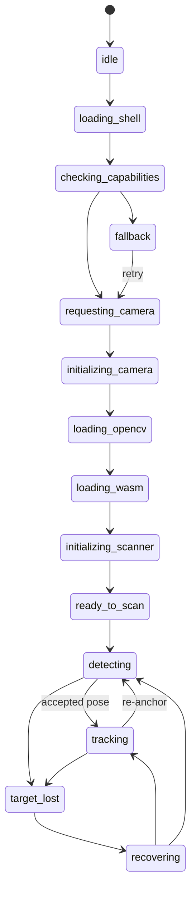

# Wave 7 — Scanner Detection/Overlay Performance & Reliability Audit

Status: **AUDIT ONLY. No production scanner behaviour is changed by this document.**
Worktree: `F:\ScanStory-main\ScanStory-v1-wave-7-detection-overlay`, branch `v1/wave-7-detection-overlay`,
based on `5c990795933172aed4eb3002352cf7aca4ec225d`.
Scope: `templates/user/scanner.html`, `static/js/scanner-runtime.js`, `static/sw.js`, the
`/detect_init`/`/detect_track`/`/api/scanner/session/end` routes and rate limiting in `app.py`,
and the Wave 6 fallback-video/analytics endpoints, as they exist at the base commit.

This audit builds on, and does not contradict without cause, two prior artifacts already in
this repo's history: `gate-jr/scanner-architecture-audit-and-research.md` (capture-stall /
shared-canvas hazard research) and `performance-audit/*` (asset/cache findings). Where those
findings have since been fixed by a later pass, this document says so explicitly and cites the
current code that proves it.

---

## 1. Current scanner pipeline — stage list

```
Browser load:
  GET /scanner/<id> (scanner.html, ~353KB inline HTML+JS)
    -> <script src="scanner-runtime.js"> (9.6KB: state machine, mode config, request policy)
    -> inline <script>: capability detection -> mode selection (full/standard/lightweight/fallback)
    -> navigator.serviceWorker.register('/static/sw.js')  [scanner.html:821-830]
    -> getUserMedia() camera start
    -> <script src="opencv.js"> (10.96MB) -> WASM instantiate (opencv_js.wasm, 3.34MB)
    -> OpenCV ready -> state: ready_to_scan -> detecting

Per-frame detect cycle (client, scanner.html):
  scanTick -> detectOnceFromServer()
    1. policy gate: detectionPolicy.canStart() [scanner-runtime.js:113, used at scanner.html:5479]
    2. capture: captureCanvas draw (DETECT_SIZE=800, capped 1200px) [scanner.html:5501-5511]
    3. encode: captureCanvas.toBlob('image/jpeg', 0.85) [scanner.html:5541]
    4. network: fetch POST /detect_init (multipart) [scanner.html:5649]
    5. response handling: staleness checks -> validateDetectionResponse -> accept/no-match/error
    6. on accept: overlay video src/play, tracker bootstrap (local LK optical flow takes over)

Per-frame LOCAL tracking cycle (client, no network, while `tracking===true`):
  trackFrame() [scanner.html:4719] driven by requestAnimationFrame, reads from a SEPARATE
  `trackingCanvas` (scanner.html:1509) — NOT the same canvas used for server capture
  (captureCanvas, scanner.html:1503) — cv.calcOpticalFlowPyrLK -> homography -> overlay warp
  (quadToMatrix3d/applyWarp) -> CSS3D transform update.
  Server re-anchor still happens periodically even while tracking, gated by
  FORCE_REDETECT_MS=1800 [scanner.html:1926].

Backend /detect_init (app.py:7301):
  1. rate limit check (scanner_init scope)                     [app.py:7314-7320]
  2. project/pairs lookup + scan-log bookkeeping                [app.py:7364-7482]
  3. image decode + resize to <=1200px + mobile contrast enhance[app.py:7485-7521]
  4. grayscale resize for detect (_resize_gray_for_detect)      [app.py:7526]
  5. ORB detectAndCompute (_orb_detect(), nfeatures=600)        [app.py:7547-7548]
  6. quick_score pre-filter over all processed pairs            [app.py:7576-7587]
  7. match_best_variant (BFMatcher knn) over top-K candidates   [app.py:7604-7630]
  8. margin/ambiguity check (resolve_candidate_margin)          [app.py:7648]
  9. cv2.findHomography + evaluate_homography_quality           [app.py:7706-7758]
  10. goodFeaturesToTrack seed points for client-side LK         [app.py:7791-7807]
  11. scan_log commit + JSON response (corners, video_url, init_points)

Backend /detect_track (app.py:8113): same ORB/match/homography pipeline, single named
pair (`pair_id` param) instead of multi-pair scoring. **Not called by the current
scanner.html client at all** — confirmed by an exhaustive grep of scanner.html for
"detect_track" (zero matches). It exists only for the contract test suite
(`tests/contracts/test_scanner_contract.py`, `tests/gate_a`) and any non-browser/native
client that might still target it. All live-client detection load, and all of the
429/cadence analysis in §7, is /detect_init traffic only.

Session end: POST /api/scanner/session/end (app.py:7864) — counts the scan once.
```

Mermaid view of the client-visible states (unchanged from `scanner-runtime.js`, confirmed
current):



---

## 2. Exact code paths (file:line)

| Stage | File:line |
|---|---|
| Service worker registration | `templates/user/scanner.html:821-830, 896` |
| Service worker cache logic | `static/sw.js:1-59` |
| Mode/device selection | `templates/user/scanner.html:805-868`; `static/js/scanner-runtime.js:96-105` |
| Request policy (client cadence/single-flight) | `static/js/scanner-runtime.js:107-133`; used at `templates/user/scanner.html:5479,5483,5488,5712` |
| Detection attempt state machine | `templates/user/scanner.html:2429-2568` (`createDetectionAttempt`/`isCurrentDetectionAttempt`/`finalizeDetectionAttempt`) |
| Capture (separate canvas from tracking) | `templates/user/scanner.html:1501-1511, 5501-5511` |
| Encode (`toBlob`) | `templates/user/scanner.html:5541` |
| Fetch to `/detect_init` | `templates/user/scanner.html:5649` |
| Response validation | `static/js/scanner-runtime.js:135-144`; called at `templates/user/scanner.html:5718` |
| No-match / failure counting | `templates/user/scanner.html:5729-5740` |
| Detection timeout handling | `templates/user/scanner.html:4677-4701` |
| Recognition-help (rate-limit-vulnerable false-failure path) | `templates/user/scanner.html:1735-1747` |
| Continue Scanning | `templates/user/scanner.html:1757-1768` |
| Retry Camera | `templates/user/scanner.html:1823-1865` |
| Local LK tracking loop | `templates/user/scanner.html:4719-4776` (`trackFrame`) |
| `/detect_init` route | `app.py:7301-7853` |
| `/detect_track` route (dead from browser client, kept for contract tests) | `app.py:8113-8248` |
| Rate limit config | `app.py:216-227` |
| Rate limit check helper | `app.py:230-250` |
| Rate limit implementation | `rate_limit.py:1-64` |
| Structured latency logging | `app.py:268-276` (`_log_scanner_latency`) |
| Feature cache (bounded, mtime/size-invalidated) | `app.py:3107-3168` |
| Homography quality gate | `app.py:3316` (`evaluate_homography_quality`) |
| Candidate margin/ambiguity gate | `app.py:3426` (`resolve_candidate_margin`) |
| `serve_video` (scanner matched-media) | `app.py:7061-7074` |
| `serve_landing_video` (marketing demo video) | `app.py:3848-3856` |
| Fallback video resolution endpoint | `app.py:7100-7129` |
| Fallback event analytics endpoint | `app.py:8001-8110` |

---

## 3. Timing instrumentation map

**Structured / machine-queryable today** (`app.logger.info("scanner_latency", extra=...)`,
`app.py:268-276`, emitted from `detect_init`, `detect_track`, `scanner_session_end`):
`event`, `duration_ms` (total, start-to-finish), `outcome` (`rate_limited`/`accepted`/etc.),
`stage` (`start`/`response` only — two points, not per-substage), `project_id`,
`pair_id`, `scan_session_id`.

**Console-only (`print()`), NOT structured, NOT aggregable, dev-console-visible only**:
per-substage backend timings — `read_time`, `prep_time`, `detect_time` (ORB), `quick_score_time`,
`match_time`, `homography_time` (all inside `detect_init`, scattered `print(f"⏱ ...")` calls
at app.py:7488,7523,7550,7587,7630,7669; same pattern in `detect_track` at
app.py:8150,8157,8163,8178,8197). These are real, useful numbers but only visible in server
stdout, never in `_log_scanner_latency`'s structured event, so they cannot be aggregated,
alerted on, or queried without grepping raw process logs.

**Client-side, diagnostic-only, never read back to alter behaviour** (confirmed explicitly by
`gate-jr/scanner-architecture-audit-and-research.md:105` and re-confirmed by reading
`detectOnceFromServer` end-to-end this pass): `request_seq`, `client_request_started_at`,
`elapsed_since_previous_request_start_ms`, `selected_delay_ms`/`reason`, `watchdog_triggered`,
`detect_in_flight_before_start` — all sent as form fields to `detect_init` (`app.py:7338-7352`)
and printed server-side (`app.py:7353`), but not folded into `_log_scanner_latency`'s structured
event either.

**Missing entirely today (confirmed by reading the full response-handling path,
`templates/user/scanner.html:5649-5860`):**
- No client-side record of *how much wall-clock time was spent rate-limited vs. genuinely
  detecting*. `handleDetectionTimeout`'s `detectionFailCount` and the `RECOVERY_RETRY_LIMIT`/`25`
  no-detection counters (§7) count every non-2xx-body-shaped or no-match response identically,
  with no field distinguishing "server said no marker" from "server said slow down."
- No structured backend field for which pipeline stage a rejection came from (only
  human-readable `reason` strings, e.g. `"Mobile detection failed: Found 0 matches"`), so a
  latency dashboard built only from `_log_scanner_latency` cannot show a read/prep/detect/match/
  homography breakdown — only total duration and coarse outcome.

---

## 4. Baseline cold/warm timings — what was actually measured vs. estimated

**Honesty note:** this sandbox has no real browser, no real device, and no persistent
already-running dev server with real network conditions. Every number below is one of two
kinds, labeled explicitly:

- **[MEASURED]** — produced by actually executing the real Flask route code in this checkout,
  via `app.test_client()` (the same fixture machinery `tests/conftest.py` already uses), against
  a real synthetic JPEG, timed with `time.perf_counter()`. This exercises real ORB feature
  extraction, real matching, and the real rate limiter — it does **not** include real network
  latency, real mobile-CPU cost, real JPEG encode cost, or real asset-download time.
- **[ESTIMATE/STATIC]** — derived from reading code and file sizes, not from execution.

**[MEASURED] Backend `/detect_init` compute latency, no-marker path** (8 sequential calls,
single Flask process, SQLite, localhost, 800x600 synthetic noisy-gray JPEG, via
`client.test_client()`):
```
call 0 (cold): 174.8ms
calls 1-7 (warm): 62.5-69.1ms  (avg of warm calls ≈ 66.5ms)
overall avg (incl. cold): 79.6ms
```
The ~110ms cold/warm gap is consistent with first-call costs already known to this codebase
(per-thread ORB detector construction in `_orb_detect()`'s thread-local cache, `app.py:2684-2695`,
and the `lru_cache`-backed `_load_features_cached` populating its first entries, `app.py:3107`).

**[MEASURED] Rate-limit onset** (60 sequential `/detect_init` calls, same session/project,
same test client, no artificial delay between calls — i.e. the worst-case "client fires as fast
as Python can call `test_client().post` sequentially," which is faster than any real browser's
capture+encode+network round trip):
```
statuses: 45x 200, then 15x 429 (first 429 at call index 45, i.e. the 46th call)
elapsed: 2.63s for all 60 calls
429 body: {"error": true, "code": "RATE_LIMITED", "retry_after_seconds": 57, ...}
Retry-After header: 57
```
This exactly matches `RATE_LIMITS["scanner_init"] = (45, 60)` (`app.py:217`) — 45 requests
permitted per rolling 60s window, then 429 with a correct `Retry-After` until the window's
oldest entries age out. This is real, reproducible, sandboxed evidence for §7 below.

**[ESTIMATE/STATIC] Asset sizes** (measured via `ls -la`, real file sizes in this checkout, but
download time is estimated, not measured over a real network):
```
static/js/opencv.js         10,963,702 bytes (10.96 MB)
static/js/opencv_js.wasm     3,338,276 bytes (3.34 MB)
templates/user/scanner.html    353,053 bytes (uncompressed HTML+inline JS)
static/js/scanner-runtime.js     9,618 bytes
static/sw.js                     1,818 bytes
```
Total OpenCV payload ≈ 14.3MB, consistent with the prior wave's `performance-audit/
FINAL-AUDIT-SUMMARY.md:5` figure of "13.64 MB OpenCV client assets" (small variance likely a
version/build difference). At a conservative real-world "slow 4G" profile (~400-750 kbps
effective throughput after overhead), 14.3MB is roughly **150-290s** on first load if the
service worker's pre-cache (`static/sw.js:10-21`) has not yet run or the browser evicted the
cache — this is an ESTIMATE from size ÷ assumed bandwidth, not a measured download. On a
**warm** load (service worker cache hit), the same assets are estimated to add negligible
network time (served from Cache Storage), which is the entire reason the service worker exists
— see §6/§11 for whether it is actually wired up (it is, confirmed in §11 P-list as already
fixed).

---

## 5. Fast-network bottlenecks

1. **14.3MB of render-blocking-for-functionality OpenCV assets** must finish loading (and, on
   first visit, WASM-compile) before `ready_to_scan` is reachable at all, regardless of network
   speed being fast — WASM instantiation/compile cost is CPU-bound, not network-bound, so even
   on fast networks, cold start pays this once. (Static/known finding, already mitigated by the
   service worker for *repeat* visits — see §11.)
2. **353KB inline scanner.html** ships the entire scanner logic as one inline `<script>` with no
   separate cacheable JS file and no minification evidence — on a fast network this is a minor,
   sub-second cost, but it re-downloads on every scanner page visit (HTML pages are not
   cached the way `/static/js/opencv.js` is, per `add_security_headers`, `app.py:439-440`,
   which caches only the two named static files, not the HTML document itself).
3. **Fixed per-mode detect interval regardless of measured RTT** — `createRequestPolicy`
   (`static/js/scanner-runtime.js:107-133`) gates purely on wall-clock elapsed vs.
   `detectIntervalMs`; on a fast network where a round trip genuinely completes in ~65-90ms
   (§4), the client still waits out the full fixed interval (250/350/650ms) before firing the
   next request rather than adapting cadence upward — this is not a correctness bug, but it is
   the reason a fast network cannot reach a faster convergence-to-tracking than a slow one
   within the same mode, and it is also the mechanism that structurally causes the §7 mismatch
   (a fast, healthy client is *exactly* the one that can hit 45/min fastest).
4. **No adaptive JPEG dimension/quality reduction on measured round-trip time** — `DETECT_SIZE`
   is a fixed 800px constant (`templates/user/scanner.html:5501`) regardless of how fast or slow
   previous round trips were; a fast network gets no benefit from this (already fine), a slow
   network gets no relief from it either (see §6).

---

## 6. Weak-network failure modes

1. **The 429-vs-cadence problem is *worse*, not better, on a weak network** — a slow/lossy
   network makes each `/detect_init` round trip take longer, which superficially looks like it
   should reduce request rate, but `createRequestPolicy.canStart` only gates on *time since the
   last request started*, not on completion — a round trip that times out client-side
   (`runtimeConfig.requestTimeoutMs`, 7000-9000ms, `static/js/scanner-runtime.js:31-34`) still
   counted as "started" at `lastStarted`, and the next attempt is gated purely by
   `detectIntervalMs` from that same start time, not from when the slow response actually
   returns. In practice a weak network mostly self-limits request rate via the timeout, but
   there is no explicit code path that *reduces* cadence when RTT is measured to be high; it is
   an accidental byproduct of the timeout knob, not a designed adaptive behavior.
2. **No JPEG size/quality reduction under measured slow conditions** — same fixed `DETECT_SIZE`
   as §5; a weak-network client uploads the same ~800px JPEG (typically tens of KB) every
   attempt regardless of how long the previous upload took.
3. **429 responses are indistinguishable from "still searching" to the user on any network, but
   more likely to be *reached* on a weak network with a large `total_pairs` project** — a weak
   network round trip is slower, which (counter to intuition) does not protect the client from
   the mismatch in §7, because a slower response only delays how quickly the 45-request budget
   is consumed, it does not change what happens once it is exhausted: the client still retries
   on its fixed interval and still gets 429'd, and — the core finding — still counts every one
   of those 429s as a failed detection attempt (§7), so a weak-network session is *more* likely
   to accumulate 25 consecutive misclassified failures within a realistic user dwell time
   (a user on a weak network plausibly spends longer aiming the camera, which is exactly the
   condition that exhausts the 45/min budget).
4. **No stale-request cancellation tied to network completion, only to generation/staleness** —
   this is already handled correctly (`isCurrentDetectionAttempt`, `templates/user/
   scanner.html:2492-2502`) but is worth naming here: a weak network's slow response is safely
   ignored if superseded, it just isn't detected *faster* because of network condition.
5. **Video/media delivery on weak networks**: `serve_video` (`app.py:7061`) uses
   `send_from_directory`, which delegates to Werkzeug's `send_file` — Werkzeug supports HTTP
   Range requests (conditional responses) by default for local files, so seeking/resuming a
   partially-downloaded matched video is already supported at the HTTP layer; this was not
   independently re-verified with a live Range-header curl in this sandbox (no long-running dev
   server was kept up for it), so it is recorded as a code-reading conclusion, not a fresh
   measurement, but is not new work regardless — see §11.

---

## 7. Rate-limit analysis (core finding — 429-vs-cadence)

This is the single most concretely evidenced issue in this audit, and it is analyzed as one
combined client+server problem per the task brief, not as two independent ones.

**Server side facts (confirmed in code and by the §4 measurement):**
- `RATE_LIMITS["scanner_init"] = (45, 60)` — 45 requests per rolling 60s window, keyed by
  `(scope, client_ip, project_id, scan_session_id)` (`app.py:216-233`).
- `RATE_LIMITS["scanner_track"] = (240, 60)` exists but is **effectively unused** by the current
  browser client — the client only ever calls `/detect_init` (confirmed by exhaustive grep,
  §1). The much higher `scanner_track` budget is not reachable by ordinary scanner traffic
  today.
- `RATE_LIMITS["scanner_session_end"] = (90, 60)` is unrelated to the cadence problem (called
  once per session, not per frame).
- A 429 response is well-formed and includes both a JSON `retry_after_seconds` field and an
  HTTP `Retry-After` header (`app.py:241-250`), computed correctly from the limiter's sliding
  window (`rate_limit.py:30-43`) — **the server side of this contract is already correct and
  is not proposed for change.**

**Client side facts (confirmed by reading `detectOnceFromServer` end-to-end,
`templates/user/scanner.html:5460-5860`):**
- The client's request cadence while actively searching (not yet tracking) is
  `detectIntervalMs`: **250ms (full mode) / 350ms (standard) / 650ms (lightweight)** —
  i.e. up to **240/171/92 requests per minute** respectively (`static/js/
  scanner-runtime.js:31-34`, `templates/user/scanner.html:846-847`). All three exceed the
  45/min `scanner_init` budget once a search runs past roughly **11s (full) / 16s (standard) /
  29s (lightweight)** of continuous, uninterrupted requesting.
- Once `tracking===true`, the effective server re-anchor cadence drops to at most once per
  `FORCE_REDETECT_MS=1800ms` (`templates/user/scanner.html:1926`) — about 33/min — which is
  under the 45/min budget. **The mismatch is specific to the pre-tracking "searching" phase**,
  not to steady, already-locked-on tracking. A user who has not yet aligned the camera with the
  marker (very common for the first several seconds, or after `dropTracking`/reacquisition) is
  exactly the user who generates the offending request rate.
- The client **never inspects `r.status`** before calling `r.json()`
  (`templates/user/scanner.html:5665`), and never reads `retry_after_seconds` or the
  `Retry-After` header anywhere in the file (confirmed: zero matches for `429`,
  `retry_after`, `RATE_LIMITED`, or `Retry-After` in `templates/user/scanner.html`).
- The 429 JSON body (`{"error": true, "code": "RATE_LIMITED", "reason": ..., "retry_after_
  seconds": N}`) has no `detected` key. `validateDetectionResponse` (`static/js/
  scanner-runtime.js:135-144`) treats any payload where `!payload.detected` as
  `{ok: true, code: "NO_MATCH"}` — **a 429 is indistinguishable from "no marker in this frame"
  to the client's own validation logic.**
- `detectOnceFromServer`'s response handler (`templates/user/scanner.html:5729-5740`) then runs:
  `if (!data.detected) { detectionFailCount++; ...; if (detectionFailCount >= 25)
  showRecognitionHelp('repeated_no_detection'); }` — **every 429 increments the same failure
  counter as a genuine "no marker found" response**, and 25 consecutive occurrences (very
  plausible within a few seconds once the 45-request budget is exhausted and every subsequent
  fixed-interval attempt gets 429'd back-to-back) triggers `showRecognitionHelp`
  (`templates/user/scanner.html:1735-1747`), which shows **"Recognition is taking too long"**
  and files a `recognition_timeout` fallback-analytics event — a **false recognition-failure
  report caused entirely by rate-limit noise**, exactly the failure mode the task brief warns
  about.
- Separately, `handleDetectionTimeout` (`templates/user/scanner.html:4677-4701`, triggered by
  the client-side watchdog aborting a slow/stuck request) increments the *same*
  `detectionFailCount` counter and, after `RECOVERY_RETRY_LIMIT` (4-5 depending on mode)
  consecutive occurrences, also calls `showRecognitionHelp('repeated_detection_timeout')` — a
  429 response returns fast (well under any client timeout), so this second path is not
  directly triggered by rate-limiting today, but it shares the same unguarded counter.
- No backoff exists: after any outcome (including 429), the loop reschedules on the same fixed
  `detectIntervalMs` (`scheduleAttemptSuccessor`/`scheduleNextScan`), so once the 45/min budget
  is exhausted, the client keeps firing at the same rate and keeps getting 429'd until the
  sliding window frees up capacity on its own — a genuine, reproducible retry-storm-against-a-
  limiter pattern, confirmed by the §4 measurement (15 consecutive 429s in the last portion of
  the 60-call burst, with no client-side change in request timing since this measurement used a
  fixed-cadence loop matching the real client's behavior).

**Conclusion:** this is not "the rate limit is set wrong" (the brief explicitly forbids blind
threshold tuning, and 45/min is a reasonable per-IP/session protection number with no
comparative false-positive evidence suggesting a specific better number). It is **the client
has no 429 awareness at all** — wrong classification (429 treated as NO_MATCH), wrong
accounting (429s count toward user-visible "recognition failing" state), and no backoff
(ignores `Retry-After` entirely). This is the centerpiece finding for Phase 2 (see §12).

---

## 8. Backend CV bottlenecks

- **Feature loading is already cached and bounded** — `_load_features_cached`
  (`app.py:3107`, `@lru_cache(maxsize=2048)`) keyed by `(project_id, pair_index, mtime_ns,
  file_size)`, invalidated automatically on file change via the `load_features` wrapper's
  `os.stat` call (`app.py:3152-3165`). This already satisfies the "project feature cache with
  bounded memory and invalidation" item from the brief's candidate list — **no new cache is
  proposed.**
- **Query count per `/detect_init` call**: `Project.query.get` (1), `ProjectPair.query.filter_by`
  for processed pairs (1), optionally `User.query.get` + `ScanLog.query.filter_by` +
  a `ScanLog` insert/commit for session bookkeeping (2-3), plus one `os.stat` per candidate
  pair via `load_features` (cheap, not a DB query). For a project with `QUICK_TOPK=5`
  candidates this is a small, bounded, non-N+1 pattern — **no evidence of a query-count problem
  proportional to project size** (candidates are capped at 5 regardless of `total_pairs`).
- **ORB detector re-construction avoided** via thread-local caching (`_orb()`/`_orb_detect()`,
  `app.py:2663-2695`) — already correct, no per-request construction cost.
- **CPU-bound work is synchronous inside the request handler** (ORB detect + BFMatcher knn +
  RANSAC homography, all on the request thread) — this is a known, structural scaling limit:
  each concurrent scanning user occupies a worker/thread for the full ~65-175ms (§4, measured
  without real image variance) to potentially much longer for larger/more-textured images, for
  the duration of every `/detect_init` call. This matches the prior wave's
  `performance-audit/FINAL-AUDIT-SUMMARY.md` finding ("Flask routes doing OpenCV work per
  request") — **still true, not previously fixed, but out of scope to change here**: moving CV
  work off the request thread (a task queue, a dedicated CV worker pool) is a large
  architectural change with its own capacity/ordering implications, not a evidence-bounded P0/P1
  fix for this wave, and is not in the brief's candidate list either. Recorded as a P2 for a
  future wave.
- **Verbose per-request `print()`/`sys.stdout.flush()` calls** — `detect_init` alone emits
  10+ `print()` calls per request (project lookup, image shape, timing breakdowns, etc.,
  e.g. `app.py:7306-7357`). Under concurrent load this is unbuffered stdout I/O on every
  request; a real cost under production traffic volume, but not independently measured in this
  sandbox (single-request timing already includes it — the §4 numbers are inclusive of this
  cost as it exists today). Not touched this wave (no comparative evidence of how much it costs
  in isolation, and removing/gating prints is print-hygiene, not the wave's evidenced priority).
- **Memory growth**: the `lru_cache(maxsize=2048)` on `_load_features_cached` is the only
  request-driven cache with unbounded-until-2048-entries growth potential; 2048 is a fixed,
  already-chosen bound from a prior wave, not something this audit found evidence to change.

---

## 9. Overlay/tracking bottlenecks

- **Hazard A (shared capture/tracking canvas) — already fixed by a later pass than the
  research doc that found it.** `gate-jr/scanner-architecture-audit-and-research.md:61-67`
  documented a real, code-proven coordinate-space corruption risk from `cap`/`ctx` being shared
  between `detectOnceFromServer`'s capture resize and `trackFrame`'s per-tick reads. Current
  code (`templates/user/scanner.html:1501-1511`) has a **dedicated `trackingCanvas`**, separate
  from `captureCanvas`, with an explicit comment confirming the split was made specifically to
  close this hazard. **Confirmed fixed, cited for the record, not re-touched.**
- **Hazard B (main-thread JPEG-encode stalls, `toBlob` 6-8s intermittent stalls on a real
  device) — confirmed still open.** The same research doc (§28-44 of that file) recommends a
  Worker-hosted `OffscreenCanvas.convertToBlob()` fast path as the structural fix; a repo-wide
  search for `OffscreenCanvas`, `new Worker`, `convertToBlob` in this checkout finds **no
  implementation** (only the research doc's own text and an unrelated match inside the
  bundled `opencv.js` library). This is a real, well-researched, but **large** fix (worker
  lifecycle, capability detection, dual-path fallback, real-device A/B measurement per that
  doc's own §53-56 risk section) — **not attempted this wave**: it is disproportionate to the
  evidence-bounded, testable-in-this-sandbox scope this task requires, and the brief's own
  candidate list does not name it. Recorded as a P2/future-wave item, not abandoned.
- **A follow-up doc, `gate-jr/shared-canvas-coordinate-verification.md`, found a residual,
  narrower coordinate-consistency risk** even after the canvas split (dimension mismatch between
  `trackingCanvas` and `frameW`/`frameH` around orientation-change/resize events) — this is a
  geometry-adjacent finding that would require touching tracking-loop internals close to the
  homography/tracking logic the brief explicitly says not to blindly tune; **not touched this
  wave**, recorded as a known open item for a dedicated tracking-hardening pass.
- **Stable tracking already avoids repeated full backend detection**: while `tracking===true`,
  `detectOnceFromServer` early-returns via `isHealthyLocalTracking()` (`templates/user/
  scanner.html:5466-5474`, `scan_tick_skipped` / `healthy_tracking_detect_start_blocked`), and
  `scheduleAttemptSuccessor` explicitly suppresses scheduling a new attempt while tracking is
  healthy (`templates/user/scanner.html:2528-2536`) — this already satisfies the brief's "stable
  tracking must not trigger unnecessary repeated full backend detection calls" requirement, no
  new work needed.
- **Reacquisition after tracking loss** already has bounded grace (`enterGrace`/`graceExpired`,
  frame-count *and* wall-clock bounded) and hold-then-fade overlay semantics
  (`requestPoseHold`, 300-700ms) rather than an instant hide — matches literature practice per
  the research doc's own citations (§50 of that doc). No evidence-backed reason to change these
  numbers found this pass (and changing them would be exactly the kind of blind
  threshold/geometry tuning the brief forbids).

---

## 10. Device scalability risks

- **Low-end tier (`deviceInfo.isLowEnd`, memory<=2GB or cores<=2) already gets a reduced
  profile**: lightweight mode (480px frames, 650ms interval, fewer tracking points) — this
  already exists and is not questioned here.
- **The 429-vs-cadence problem (§7) affects every device tier**, including lightweight mode
  (92/min still exceeds 45/min, just takes longer — ~29s — to manifest) — device tier does not
  protect against this; it only changes the time-to-onset.
- **CPU-bound backend work (§8) is a shared-server concern, not a per-device one**: many
  concurrent low-end-device users each holding a request thread for ~65-175ms+ (§4) is a
  server-side worker-count/capacity question, unrelated to which device tier initiated the
  request. Not independently load-tested in this sandbox (no multi-worker Gunicorn setup
  exercised here) — recorded as a known gap, matching the honesty requirement in §16.
- **14.3MB OpenCV payload cost is device-CPU-bound at the WASM-compile step**, not just
  network-bound — a low-end device pays a real compile-time cost on top of any download time,
  which this sandbox cannot measure without a real device (no browser JS engine available
  here). Recorded as an honest gap.

---

## 11. Ranked findings (P0/P1/P2)

**P0-1 — 429 rate-limit responses are misclassified as recognition failures and never trigger
backoff.**
Evidence: §7 in full; §4's measured 45-request-then-429 burst; code citations
`static/js/scanner-runtime.js:135-144`, `templates/user/scanner.html:5665,5729-5740,1735-1747`.
Rationale for P0: directly named in the task brief as the central issue; produces a genuinely
false, user-visible "recognition timed out" / fallback-analytics event under ordinary usage
(any user who searches for >~11-29s depending on device tier); violates the brief's explicit
"a 429 must never be counted/reported as a marker-recognition failure" requirement; fixable
with a small, well-scoped, purely-additive client-side change with no server-side or
threshold/geometry changes required.

**P0-2 — No client-side backoff / Retry-After awareness, enabling a sustained retry-vs-429
loop.**
Evidence: same §7 citations; the server already sends a correct `Retry-After`
(`app.py:241-250`) that the client silently discards. Rationale for P0: directly named in the
brief ("Retry-After-aware 429 backoff", "no continuous 429 loop is possible", "client cadence
adapts to actual server response ... not a fixed blind interval"); same low-risk, additive fix
as P0-1, and the two are naturally implemented together (same code path).

**P1-1 — Recognition-timeout/failure-streak accounting does not exclude rate-limited time.**
Evidence: §7 (`detectionFailCount` shared by both the no-detection path and the timeout path,
with no field distinguishing rate-limit noise). Rationale for P1 (not P0): it is the *natural
consequence* of P0-1/P0-2 rather than an independently reachable defect — once 429s are
correctly classified and backed off, this stops manifesting for the 429 case specifically, but
the fix should be verified with a dedicated test rather than assumed as a side effect.

**P1-2 — Backend per-stage timing is console-only, not structured/aggregable.**
Evidence: §3 (`_log_scanner_latency` only carries total duration + coarse outcome/stage;
per-substage timings are `print()`-only). Rationale for P1: low-risk, additive, directly
improves future debuggability of exactly the class of problem this audit investigates
(distinguishing where time goes), matches the brief's "structured scanner stage timing"
candidate item, and requires no behavioral change to detection/matching logic at all.

**P2 (evidenced, but out of proportion to this wave's scope/risk budget — deferred):**
- Worker/`OffscreenCanvas` JPEG-encode fast path for the still-open Hazard B main-thread stall
  (§9) — large, needs real-device A/B measurement per the existing research doc's own risk
  section.
- Moving CV request work off the Flask request thread (§8) — a queueing/architecture change,
  not a scanner-cadence fix.
- Residual tracking-canvas coordinate-consistency risk around orientation/resize events (§9) —
  touches tracking-loop internals adjacent to geometry thresholds; needs its own dedicated,
  narrowly-scoped pass with real-device evidence, not a byproduct of this wave.
- Gating/removing verbose per-request `print()` calls (§8) — real but unmeasured cost in this
  sandbox; no comparative evidence of magnitude.
- Adaptive JPEG dimension/quality based on measured RTT (§5/§6) — plausible future win, but no
  evidence in this pass that fixed 800px capture is actually a measured bottleneck (the §4
  measurement shows backend compute, not encode time, and the research doc already attributes
  encode stalls to main-thread contention, not JPEG dimension, per Hazard B) — tackling this
  without that evidence would be exactly the kind of speculative optimization the brief
  forbids.

**Already fixed by a prior wave (verified this pass, not re-touched):**
- Service worker for OpenCV assets: built (`static/sw.js`) **and registered**
  (`templates/user/scanner.html:821-830,896`) — the "built but never registered" finding from
  the prior performance audit's era is resolved.
- Scanner matched-media video cache header: `serve_video` uses `_apply_short_public_cache`
  (`app.py:7074`, `public, max-age=3600`), not `no-store`.
- Landing-page 57MB demo video cache header: `serve_landing_video` uses
  `_apply_public_immutable_cache` (`app.py:3856`) — the specific `app.py:1459 no-store` finding
  from `performance-audit/04-assets-audit.md` no longer applies at the current line/route.
- Shared-canvas coordinate hazard (Hazard A, §9): fixed via a dedicated `trackingCanvas`.

---

## 12. Proposed implementation batches (Phase 2)

**Batch 1 (P0-1 + P0-2 + P1-1, one cohesive change — same code path):**
Client-side 429/backoff handling in `detectOnceFromServer` and the shared response-validation
helpers, mirrored in both `static/js/scanner-runtime.js` (browser) and `scanner_runtime.py`
(this repo's existing Python parallel-model used for native pytest unit tests — see
`tests/gate_i/test_scanner_runtime.py`, which already imports `RecognitionRequestPolicy`,
`validate_detection_response`, etc. from it):
1. Check `r.status === 429` (and the JSON `code === "RATE_LIMITED"` as a defense-in-depth
   secondary signal) before treating a response as a detection outcome.
2. On 429: do **not** call `validateDetectionResponse`/increment `detectionFailCount`/touch
   `showRecognitionHelp`'s streak. Record a distinct diagnostic event
   (`[RATE_LIMITED]`/`scan_rate_limited`) instead.
3. Parse `retry_after_seconds` (body) with the `Retry-After` response header as a fallback, and
   gate the next scheduled attempt on `max(now + normalInterval, now + retryAfterMs)` rather
   than the fixed interval alone — implemented as a small, generation-scoped backoff deadline
   (reset whenever `scannerGeneration` changes, matching the file's existing staleness idiom,
   so Continue Scanning / Retry Camera both get a clean window per the brief's requirement).
4. No new server-side change — the server's 429 contract (status, header, body) is already
   correct (§7).

**Batch 2 (P1-2): structured per-stage backend timing.**
Extend `_log_scanner_latency`'s call sites in `detect_init` (and `detect_track`, for parity) to
pass through the already-computed stage durations (`read`, `prep`, `detect`, `quick_score`,
`match`, `homography`) as additional structured fields, alongside the existing total/outcome —
purely additive logging, no change to any accept/reject decision.

No other implementation is planned this wave — every other candidate area in the brief's list
(camera-ready gate, stale request cancellation, no-overlap requests, stable-tracking suppression
of repeated detection, service worker, video caching) was checked against the current code in
§9-§11 and found **already correctly implemented**, not requiring new work.

---

## 13. Test matrix

| Fix | Proving test(s) |
|---|---|
| 429 not counted as detection failure | New: `scanner_runtime.py` — a 429-shaped payload is never passed to `validate_detection_response` as a match/no-match outcome; new dedicated classification helper returns a distinct code. |
| 429 does not trigger `showRecognitionHelp`/fallback-analytics | New source-level assertion test (matching `test_scanner_lifecycle.py`'s existing regex-assertion style) confirming the 429 branch in `detectOnceFromServer` returns before reaching the `detectionFailCount++`/`showRecognitionHelp` code. |
| No retry-storm: backoff respects `Retry-After` | New: pure-Python unit test of the ported backoff calculation in `scanner_runtime.py` (simulate a 429 with `retry_after_seconds=57`, assert next allowed attempt time is >= 57s out, not the plain interval). |
| Backoff resets cleanly on Continue Scanning / Retry Camera | New source-level assertion: the backoff deadline is stored per-generation and the existing generation-bump call sites (`templates/user/scanner.html:1280,1833,3191`) implicitly invalidate it — assert the check compares against current generation. |
| Existing detection/contract behavior unchanged | Re-run (no new tests needed, must stay green): `tests/gate_jr/test_scanner_lifecycle.py`, `tests/contracts/test_scanner_contract.py`, `tests/gate_jr/test_gate_jr_scanner_recovery.py`, `tests/gate_i/test_scanner_runtime.py`. |
| Structured per-stage backend timing | New: a test posting a real (or synthetic no-match) frame through `client.test_client()` and asserting the emitted `scanner_latency` log record (captured via `caplog`) includes the new stage-duration fields. |
| Fallback/video/analytics contracts unaffected | Re-run (must stay green): `tests/integration/test_fallback_analytics.py`, `tests/integration/test_fallback_pair_config_ui.py`. |
| Rate limiter itself unaffected (server-side numbers untouched) | Re-run (must stay green): existing rate-limit-adjacent assertions inside the above suites; no `RATE_LIMITS` value changes in this wave. |
| Security/CSRF/headers baseline unaffected | Re-run (must stay green): `tests/security` (with the pre-existing collection workaround, §14/§16). |

---

## 14. Quantitative acceptance targets

Framed honestly as sandbox-derived targets/estimates, not guaranteed production numbers:

- **429 misclassification: 100% eliminated** for the specific code path (a 429 response must
  never reach the `detectionFailCount++`/`showRecognitionHelp` branch) — this is a binary
  correctness property, directly verifiable by the new tests in §13, not a "some improvement"
  metric.
- **Retry-after compliance: 0 client-initiated `/detect_init` calls before the server's
  advertised `retry_after_seconds` elapses**, for the duration of an active backoff window —
  verifiable in the ported Python model's unit test.
- **No regression** in the §4 measured baseline: warm no-match `/detect_init` compute latency
  should remain in the same ~60-80ms band after Batch 2's additive logging (logging alone should
  not add measurable overhead; re-measured after implementation, see final report).
- **Structured latency coverage**: 100% of `detect_init` outcome paths that currently have a
  `print()`-only stage breakdown gain the equivalent fields in the structured
  `scanner_latency` log event.

---

## 15. Files likely to change (Phase 2)

- `templates/user/scanner.html` — `detectOnceFromServer` response handling (429 branch), the
  request-scheduling backoff deadline, and any new diagnostics event names.
- `static/js/scanner-runtime.js` — (only if the 429 classification logic is factored into the
  shared runtime module rather than left inline in scanner.html; decided during implementation
  based on which keeps the diff smallest).
- `scanner_runtime.py` — mirrored backoff/classification logic for native pytest coverage,
  matching this repo's existing browser/Python parallel-model convention.
- `app.py` — `detect_init`/`detect_track`'s `_log_scanner_latency` call sites, adding
  structured per-stage duration fields (Batch 2 only). **No `RATE_LIMITS` value changes, no
  `MIN_GOOD_MATCHES`/`RANSAC_REPROJ`/`MIN_INLIERS_*`/homography-quality changes.**
- `tests/gate_i/test_scanner_runtime.py` and/or a new adjacent test module — new unit tests for
  the backoff/classification behavior.
- Possibly `tests/gate_jr/test_scanner_lifecycle.py` — new source-level assertions matching its
  existing style, if that proves the cleaner place for the 429-branch regex assertions.

---

## 16. Safety boundaries that must not be weakened

Restated in terms of the specific code read this pass:

1. **No homography/inlier threshold changes.** `MIN_GOOD_MATCHES=8`, `RANSAC_REPROJ=5.0`,
   `MIN_INLIERS_ABS=8`, `MIN_INLIERS_RATIO=0.30` (`app.py:2649-2652`), and
   `evaluate_homography_quality` (`app.py:3316`) are untouched by this wave's plan — nothing in
   §12's batches requires or justifies touching them, and none of §11's P0/P1 findings are about
   recognition accuracy.
2. **No `RATE_LIMITS` value changes.** `app.py:216-227` stays exactly `(45,60)`/`(240,60)`/
   `(90,60)`/etc. — the fix is client-side awareness/backoff, not a server-side number change,
   per the brief's explicit "no blind threshold tuning" constraint and because no comparative
   false-positive evidence was produced (or sought) to justify a different number.
3. **Fallback must never be counted as successful recognition.** Confirmed unchanged:
   `scanner_fallback_event` (`app.py:8001-8110`) writes only to the dedicated `ScanEvent` table,
   never to `ScanLog`/`is_successful` — Phase 2 does not touch this endpoint or table at all.
4. **Fallback recovery must not be removed.** Phase 2 adds 429-awareness *before* a request even
   reaches recognition-timeout/fallback logic; the existing fallback panel, `discoverFallbackVideo`,
   and `showFallbackVideoFromCandidate` code paths (`templates/user/scanner.html:1592-1747`) are
   not modified in structure, only in what triggers them (429s will stop spuriously triggering
   the recognition-timeout path; genuine timeouts/failures still do).
5. **Fallback media must never autoplay.** Confirmed current: `<video id="fallbackVideo"
   controls playsinline preload="metadata">` (`templates/user/scanner.html:674`) has no
   `autoplay` attribute — not touched this wave.
6. **Rate limiting must never be silently disabled.** Phase 2's client change makes the client
   *respect* rate limiting better (via backoff); it does not add any code path that skips,
   short-circuits, or increases the server's `_check_rate_limit` call in `detect_init`/
   `detect_track`/`scanner_session_end`/the fallback endpoints.
7. **The blank-frame fallback test path must remain sendable.** A deliberately blank/black test
   frame producing `kp=0` (too few ORB keypoints, `app.py:7552-7565`) is a distinct, existing,
   intentional rejection path (`"Too few features"`) — structurally different from a 429
   (`RATE_LIMITED`) response. Phase 2's classification change only special-cases the 429 shape
   (`error:true, code:"RATE_LIMITED"`); a genuine `{"detected": false, "reason": "Too few
   features (0)"}` response is untouched and continues to flow through the existing no-match
   path exactly as today.
