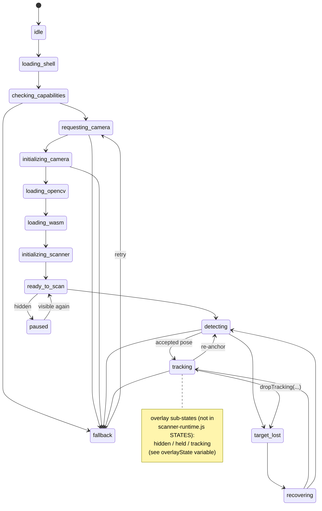

# ScanStory Scanner — Real-Device Audit, State-of-the-Art Research, and Architecture Recommendation

**Status: AUDIT AND RESEARCH ONLY. No production scanner behaviour was changed to produce this report.**

Repository: `F:\ScanStory-main\ScanStory-integration`, branch `integration/scanner-stability`.
Scope: `templates/user/scanner.html` (inline scanner JS) and `static/js/scanner-runtime.js`, correlated against reported real-device video/console/backend evidence (evidence supplied as prose in the task; no video/log files exist in this checkout — verified by directory search).

---

## 1-3. Confirmed findings (video / console / backend)

**User-visible (video), as reported:** periodic multi-second unresponsiveness; card overlay not continuously stable; overlay shape can disappear while the card is still visible; overlay returns after server reacquisition; overall pattern of pause/disappear/detach/resume/reacquire, not simple slow recognition.

**Console (proven by the supplied timing pairs):**
- `drawImage`: ~41-51ms consistently (requests 24, 25, 27) — **not** the bottleneck.
- `toBlob`: alternates between ~100-200ms (normal) and 6,159-7,534ms (pathological) on the **same device/session** (requests 24, 27, 28) — confirmed intermittent, not constant.
- Watchdog fires (`[WATCHDOG TICK]`/`[WATCHDOG ABORT]`) during these long encode windows, before the in-flight attempt ever reaches `[FETCH START]`.
- `[TRACKING LOST DURING PLAYBACK]` observed with `ended:false, paused:false, loop:true` — video was genuinely mid-playback, native loop functional, when local tracking dropped.
- Repeated `[SCAN TIMER FIRED]`/`[SCAN SCHEDULED]` pairs during long encode/fetch windows.

**Backend:** correctly identifies pairs and accepts valid homographies (16/20, 27/36, 37/48, 22/29 inlier examples given); processing 0.19-0.63s; some frames correctly rejected (weak inliers, invalid corners/quad, pose-quality) — the recognizer itself is operating normally. Frontend encoding stalls (4-8s) are materially larger than backend processing time, confirming the bottleneck is client-side, not server-side.

---

## 4-6. Capture timing evidence, normal vs. pathological

| Request | drawImage | toBlob | Classification |
|---|---|---|---|
| 24 | ~41ms | **7534ms** | pathological |
| 25 | ~51ms | ~100-200ms (typical) | normal |
| 27 | ~43ms | **6316ms** | pathological |
| 28 | (not separately given) | **6159ms** | pathological |

drawImage is a synchronous canvas-to-canvas blit of an already-decoded `<video>` frame — consistently fast, as expected; it performs no encoding work. `toBlob` invokes the browser's native JPEG encoder asynchronously; its callback is dispatched via the browser's own task queue once encoding completes — this is where the multi-second stalls concentrate, on the *same device*, alternating with normal-speed encodes in the *same session*. This rules out a permanently slow device/browser and points to an intermittent resource-contention condition (see §9 for the leading code-level candidate).

---

## 7-10. Card-overlay shape-loss: classes, callers, and correlation with the encoding stall

### 7-8. Exact callers/reasons that clear, hide, or reject geometry

All **local-tracking-loss** callers of `dropTracking(reason, extraMats)` (all inside `trackFrame()`, the rAF-driven Lucas-Kanade loop):

| Reason | Trigger |
|---|---|
| `insufficient_flow_points` | fewer than `MIN_GOOD_POINTS` (12/16/20 by device tier) survive the LK status+error filter, after a bounded grace period |
| `homography_empty` | `cv.findHomography(prevMat, nextMat, cv.RANSAC, RANSAC_REPROJ, mask)` returns an empty matrix |
| `corner_order_invalid` | `normalizeCornerOrder()` rejects the locally re-projected quad (non-finite, zero-edge, collapsed-area, self-intersecting, non-convex-diagonal, or reversed winding) |
| `out_of_bounds` | all 4 corners drift beyond a 40%-of-frame padding band |
| `pose_rejected_<reason>` | `poseCompatibility()` (temporal consistency vs. the last accepted pose) rejects after a grace period — sub-reasons: `winding_flip`, `self_intersecting_quad`, `area_jump` (ratio outside 0.4-2.5), `center_jump` (>0.35× frame-min), `corner_jump` (>0.55× frame-min), `edge_ratio_jump` (outside 0.5-2.0×), `diagonal_jump` (>2.0×) |
| `tracking_geometry_invalid` | `applyWarp()` itself rejects the locally-tracked quad before it can be rendered |

**Server-response-side** rejection/hold points (distinct from `dropTracking`, all funnel through `requestPoseHold(reason)` — hold-then-fade, never an instant hide, per the existing 300-700ms pose-hold design): `invalid_quad` (pre-conversion renderability check), `corner_order_invalid` (post-conversion correspondence failure), `interpolated_quad_invalid` (smoothing produced a degenerate quad), `non_finite_matrix` (perspective matrix has a NaN/Inf entry), `no_detection` (server found nothing, only while not already tracking).

**Unconditional hide** (`stopOverlayImmediate`, no hold): camera restart/recovery (`clearTrackingGeometry(reason)` without `holdPose:true`), pose-quality rejection while *not already tracking* (`clearTrackingGeometry('pose_rejected_' + reason)`), session end.

**Conclusion on 7-8:** every geometry-clearing/hiding path is reason-tagged and traceable; none of the *local* `dropTracking` reasons are network/session/watchdog-caused — confirmed by direct string search (no `network_timeout`/`capture_timeout`/`session_ending`/`watchdog` token anywhere inside `trackFrame()`'s body).

### 9-10. Correlation between encoding stalls and tracking loss — **two independent, code-provable hazards found**, not one

**Hazard A — shared mutable canvas between the tracking loop and the detection capture (highest-confidence, newly identified this pass).**
`cap`/`ctx` (`document.getElementById("cap")`, 2D context with `willReadFrequently:true`) is the **same single canvas element** used by:
- `detectOnceFromServer()` — sets `cap.width = capW; cap.height = capH` (~800px capture target) at the top of every detect attempt, and only restores `cap.width = frameW; cap.height = frameH` (the server's own frame dimensions, which is the coordinate space `currCorners`/`prevPts` are expressed in) **inside the accepted-detection branch specifically** (`if (data.detected)` and `requestId > latestAppliedSequence`).
- `matFromVideoGray()` (called every tracked rAF tick from `trackFrame()`) — draws and reads at **whatever `cap.width/height` currently is**, with no resize and no dimension check of its own.

Every non-accepting outcome of `detectOnceFromServer` — no-detection, stale generation/frame-size/orientation, stale applied-sequence, failed validation — returns **without restoring `cap` to `frameW`×`frameH`**. Since the detect loop keeps re-anchoring periodically even while actively tracking (`FORCE_REDETECT_MS`), and a fetch round-trip (200ms-8s, per the very evidence in this report) holds `cap` at the ~800px capture size for its entire duration, any `trackFrame()` rAF tick that fires during that window — which is likely, since awaits yield the main thread — reads image data at the **wrong dimensions relative to the coordinate space `currCorners`/`prevPts` were computed in**. `cv.calcOpticalFlowPyrLK(prevGray, gray, prevPts, ...)` is then called across mismatched-scale frames with no dimension-consistency guard anywhere in `trackFrame()`. This is a direct, code-provable mechanism for corrupted flow vectors → wrong/garbage corner positions → any of `out_of_bounds`, `corner_order_invalid`, `tracking_geometry_invalid`, `pose_rejected_*` firing on a frame that had nothing wrong with it optically. It also means the two loops are genuinely fighting for the same canvas readback (`getImageData`) resource on the main thread at the same time capture is trying to encode from it — a plausible *contributor* to the encoding contention itself, not just a symptom of it.

**Hazard B — main-thread/native-encoder contention (the toBlob stall itself).** `ctx.drawImage`+`toBlob`(detection) and `ctx.drawImage`+`getImageData`(tracking, every ~50-90ms while tracking) both compete for the same canvas backing store and (on many mobile GPU/canvas implementations) the same main-thread-adjacent readback path. `willReadFrequently:true` hints the browser toward a software/CPU-backed canvas specifically to make `getImageData` cheap — a reasonable choice for the tracking loop's needs, but it also means `toBlob`'s JPEG encode is competing against a canvas backend optimized for *readback*, not *encode throughput*, on a canvas that a second loop is concurrently drawing into and reading from every ~50-90ms.

**Answering the required A-G questions:**
- **A (genuine local optical-flow failure)?** Yes, in the ordinary case — this is the loop's designed, expected behaviour for real marker loss, and the majority of `dropTracking` firings are presumably this.
- **B (amplified by main-thread starvation during toBlob)?** Plausible contributor via Hazard B, not yet isolated from Hazard A/C by the current diagnostics alone.
- **C (long frame gap invalidates optical-flow correspondence)?** Yes, structurally — `trackFrame`'s own grace-period logic (`enterGrace`/`graceExpired`, bounded by frame count *and* a wall-clock ceiling `TRACKING_GRACE_MS`) exists specifically because a stalled/skipped frame makes `prevPts`-to-`nextPts` correspondence stale; a multi-second capture-phase stall (which does NOT pause `trackFrame`'s own rAF cadence) plausibly exhausts this grace window.
- **D (overly aggressive geometry validation)?** Not supported by the evidence — thresholds (area 0.4-2.5×, center-jump 0.35, corner-jump 0.55, edge-ratio 0.5-2.0×, diagonal 2.0×) are all already generous multi-frame tolerances, and backend inlier/rejection evidence shows the *recognizer* is behaving normally; no evidence of false-rejection at these specific gates.
- **E (incorrect corner order or transformation)?** No — fixed `[TL,TR,BR,BL]` order is preserved end-to-end (`normalizeCornerOrder`/`resolveCornerCorrespondence` only ever copy, never permute); Hazard A is a coordinate-*space* (scale) mismatch, not an ordering defect.
- **F (overlay visibility/playback-state handling rather than geometry loss)?** Ruled out as the *sole* cause — `[TRACKING LOST DURING PLAYBACK]`'s own `ended:false,paused:false` confirms genuine geometry-loss handling (`dropTracking`→`clearTrackingGeometry(...,{holdPose:true})`) is what triggered the visible pause, not an independent playback bug.
- **G (multiple distinct classes)?** **Yes, at least two**: (1) genuine local tracking failure (expected, correct behaviour), and (2) the canvas-sharing coordinate-mismatch hazard (Hazard A) — a latent defect that can manufacture spurious tracking failures that look identical to (1) in the logs but have a completely different root cause.

---

## 11-14. Tracking, long-frame-gap, transform, and video/loop findings

**Tracking point quality/coverage:** `trackFrame` seeds points either from the server's own `init_points` (up to `MAX_TRACK_POINTS`, 70/120/180 by device tier) or, if fewer than 25 returned, a synthetic 10×10 bilinear grid across the detected quad — the latter guarantees spatial coverage across the whole card, the former depends entirely on what the server chose to return (not audited server-side this pass; out of scope — server code untouched). No explicit forward-backward (TLD-style) consistency check exists today — only OpenCV's own `status`/`err` (`MAX_ERR`) output filtering. No explicit minimum-spatial-coverage check on the tracked point set itself (coverage is only enforced at the *initial seeding* grid, not maintained/re-verified as points are pruned frame to frame).

**Long-frame-gap handling:** `enterGrace()`/`graceExpired()` provide bounded tolerance (frame-count *and* wall-clock, `TRACKING_GRACE_MS`) before `dropTracking` fires on `insufficient_flow_points`/pose-rejection — this is a real, existing safeguard, but it assumes `prevGray`/`gray` are dimensionally consistent, which Hazard A can violate independent of elapsed time.

**Overlay transform / corner order:** `quadToMatrix3d` builds a true projective (not affine) 4-point mapping; `applyWarp` runs generation/sequence staleness → renderability → correspondence → temporal smoothing (`smoothPoseCorners`, exponential with a still/moving dual time-constant) → matrix-finiteness, each step logging distinctly and holding (never silently failing) on rejection. Corner order is never reordered anywhere in this chain — confirmed by reading every function in the chain.

**Video/loop:** `<video id="overlay" autoplay playsinline loop preload="auto">` — native `loop` present and, per the supplied evidence itself, functional. The `ended` listener only sets a local `videoFinished` flag (console log only) — confirmed never touching `tracking`/geometry. Source reassignment (`overlay.src = newVideoUrl`) occurs at exactly one call site, on genuine marker-pair switch, confirmed via the existing `test_overlay_src_is_only_reassigned_on_marker_switch` test. No manual replay/ended-workaround exists or is warranted.

---

## 15-25. Watchdog, AbortController, timer/scheduler, session-end, and diagnostic-correctness findings

*(These mechanisms were the subject of prior audit/fix passes this session — summarized here for completeness, re-verified against the current code as it stands uncommitted.)*

**Watchdog baseline:** two independent elapsed clocks now exist — `lastRequestStartAt` (capture-inclusive, used only for the "nothing started at all" force-detect branch and the "still capturing, nothing to abort yet" log-only branch) and `lastFetchStartAt` (stamped immediately before the fetch call, used exclusively by the branch that actually calls `.abort()`). This was fixed in the immediately preceding pass specifically because the two clocks were previously conflated, making a brand-new fetch look pre-expired the instant a slow capture phase finished — this explains the reported `[FETCH START]`→`[WATCHDOG ABORT]` sequences from *before* that fix. **Given the evidence in *this* task still shows watchdog activity before `[FETCH START]`,** re-confirm: those are the log-only "stuck before network request" branch (no `activeDetectionController` exists yet, no abort is attempted, no counter increments) — not an abort of a nonexistent or foreign controller. This matches "misleading diagnostics" only in the sense that a `[WATCHDOG ABORT]` tag is emitted for this log-only case too (same tag, different `reason` field) — a labelling nuance worth resolving in the future design (§46), not a functional bug.

**AbortController ownership:** exactly one abort call site (`watchdogTick`'s real-fetch branch); `activeDetectionController` is a single module-level variable, cleared unconditionally in the `catch` block on any settle. `detectInFlight` prevents a second `detectOnceFromServer` from starting while one is outstanding; `watchdogTick`'s own `token !== scanLoopToken` guard retires stale watchdog instances the instant the loop restarts. No reachable scenario found (single-threaded, no overlapping `watchdogTick` executions, only one controller variable ever) where a controller from request N survives meaningfully into request N+1, or where a *completed* fetch's controller is abortable afterward (it's nulled in `catch`, and successful completion path also proceeds past the point where `activeDetectionController === controller` before any further await). Can the same controller be aborted more than once? Only in the narrow window between one `.abort()` call and the fetch promise's actual rejection settling — `AbortController.abort()` on an already-aborted controller is specified as a no-op, not an error.

**Timer/scheduler:** `scheduleNextScan` unconditionally clears any existing `detectLoopTimer` before setting a new one; `startDetectLoop` no-ops if a timer is already pending — together these structurally guarantee at most one pending scan timer. The repeated `[SCAN TIMER FIRED]`/`[SCAN SCHEDULED]` sequences in the evidence match model **A (one normal repeating chain)** — this is what a healthy self-rescheduling loop firing every `DETECT_INTERVAL_MS` (250-650ms by tier) looks like when many are printed in a row during a long encode/fetch window; it is not proof of duplicate timers.

**Session-end stale work:** fixed in the immediately preceding pass — a `sessionEnding` check now exists at the capture-end/pre-fetch boundary (previously the only checks were pre-capture and post-fetch-resolve), closing the specific window where a session-end occurring mid-encode could still start a real fetch afterward.

**Diagnostic correctness:** `elapsed_since_previous_request_start_ms`/`watchdog_triggered`/`watchdog_abort_requested` sent to the backend are computed fresh per request (`diagState.lastRequestGapMs`, snapshotted before each new request overwrites `lastRequestStartAt`) — not stale/copied from an earlier request by construction, though they are **purely diagnostic**: none of these fields are read back by the client to alter behaviour; they exist only for server-side log correlation.

---

## 26-27. State-transition diagram and async ownership map



This is the **actual, current** `STATES`/`TRANSITIONS` graph from `scanner-runtime.js` (unmodified this pass) — it does not natively encode capture/encoding/network phases; those live entirely as separate untyped local variables (`detectInFlight`, `activeDetectionController`, etc.) layered on top, which is precisely the gap the future "attempt object" design (§45) closes.

**Shared state field inventory** (confirmed present, current names):
`detectInFlight`, `detectLoopTimer`, `watchdogTimerId`, `lastRequestStartAt`, `lastFetchStartAt`, `activeDetectionController`, `clientRequestSeq`, `scannerGeneration`, `scanLoopToken`, `scanTimerGeneration`, `sessionEnding`/`sessionEnded`/`sessionEnding`, `tracking`, `lastLockTs`/`lastDetectTs`/`lastTrustedPoseTs`, `currentPairId`, `currentVideoUrl`, `overlayState`, `cap`/`ctx` (shared canvas — see Hazard A), `watchdogAbortCount`/`watchdogAbortCountSession`, `detectionFailCount`/`recoveryAttempt`, `cameraStream`.

**Async-boundary table** (abridged to the boundaries this and prior passes actually touched or newly identified):

| Boundary | State before | State after | Owner check | Stale guard | Cleanup | Reschedule |
|---|---|---|---|---|---|---|
| capture (drawImage+toBlob) | `detectInFlight=true`, no controller | same | none (no controller exists yet) | `sessionEnding` (added this session, post-capture) | n/a | n/a (still inside one attempt) |
| fetch | controller created | resolved/rejected | `activeDetectionController===controller` | generation/frame-size/orientation/applied-sequence (post-response) | `catch` nulls controller | `scanTick`'s `finally` (always) |
| watchdog tick | independent chain | — | `token===scanLoopToken` | n/a (own chain) | — | `scheduleWatchdog` (always) |
| session end | any | ended | — | `sessionEnding` checked at 3 points (pre-capture, post-capture **[new]**, post-fetch) | full teardown | none (terminal) |

---

## 28-37. Primary-source research (Phase 8)

Researched via WebSearch/WebFetch against WHATWG/W3C/MDN/Chrome-for-Developers/OpenCV primary sources and MDN's own browser-compat-data, per the task's required source-preference order.

**28. Primary sources reviewed:** WHATWG HTML Standard (canvas scripting section); MDN API references and raw `browser-compat-data` for `OffscreenCanvas.convertToBlob`, `HTMLVideoElement.requestVideoFrameCallback`, `ImageCapture`, `createImageBitmap`, `ImageBitmap.close()`, WebCodecs; web.dev articles (OffscreenCanvas, rVFC); caniuse.com; a filed `mdn/browser-compat-data` GitHub issue (#24569) correcting a false-positive Safari compat claim; original papers — Lucas & Kanade 1981 (CMU Robotics Institute record), Bouguet's pyramidal-LK technical note (Stanford CS223B course mirror), Kalal/Mikolajczyk/Matas 2010 forward-backward error (author's own PDF + ACM DL record), Fischler & Bolles 1981 RANSAC (*CACM* 24(6)), Casiez/Roussel/Vogel 2012 One Euro Filter (*CHI 2012*, author's own PDF).

**29. Browser compatibility findings** (current, source-verified — see per-API citations below, not assumed from training data):

| API | Chrome (Android+desktop) | Safari desktop | Safari iOS | Firefox |
|---|---|---|---|---|
| `canvas.toBlob()` | universal, long-standing | universal | universal | universal |
| `OffscreenCanvas.convertToBlob()` | 69+ | **16.4+** (Mar 2023) | 16.4+ | 105+ |
| `requestVideoFrameCallback()` | 83+ | **15.4+** (Mar 2022) | 15.4+ | 132+ (late) |
| `ImageCapture.grabFrame()` | 59+ (2017) | **26 only** (2025) | not before 26 | **never shipped** |
| `createImageBitmap()` (basic) | long-standing | broadly ~15.5+, full options later | broadly ~15.6+, full ~17.6+/18+ | long-standing |
| WebCodecs | 94+ | partial 16.4-18.7, full only at **26** | same | not shipped |
| `MediaStreamTrackProcessor` | 94+ (Chromium) | **not actually supported** despite some compat tables claiming v18 (filed bug, see below) | not supported | not supported |

**30. `toBlob()` research findings:** per the WHATWG HTML spec, `toBlob(callback, type, quality)` returns `undefined` immediately and "queues a task" (on the canvas-blob-serialization task source) to invoke the callback once encoding finishes — genuinely asynchronous, but the spec provides **no cancellation handle and no timing guarantee**. MDN documents that the callback can receive `null` "if the image cannot be created for any reason," an escape hatch callers must already handle (this codebase's `new Promise(res => cap.toBlob(res, ...))` wrapper does **not** currently guard against a `null` blob reaching `fd.append("test_image", blob, ...)` — a latent minor gap, not the main bug, noted for the future design). The "queue a task" wording only guarantees eventual, main-thread-serialized delivery — a busy main thread (GC pauses, the concurrent LK tracking tick reading the same canvas, other pending tasks) can arbitrarily delay when that queued callback actually runs. This is fully consistent with the observed intermittent 6-8s stalls on an otherwise-fast device: it is a documented architectural property of the API, not a browser defect, and confirms `toBlob()` itself provides no mechanism to bound or cancel a slow encode.

**31. `OffscreenCanvas` research findings:** `convertToBlob()` reached Baseline-broad availability by March 2023 (Safari 16.4 was the last major engine). It works from **both the main thread and Workers** — but calling it from the main thread does **not** remove main-thread contention; the actual win only materializes when the canvas is transferred into (or created inside) a **Worker**, moving the JPEG encode fully off the main thread. That requires either `transferControlToOffscreen()` or constructing the `OffscreenCanvas` inside the worker and feeding it frames via transferred `ImageBitmap`s — real architectural complexity (message-passing protocol, worker lifecycle management, transferable-object bookkeeping), not a drop-in swap for the current single-thread `drawImage`+`toBlob` call.

**32. `requestVideoFrameCallback()` research findings:** synchronizes to **presented/composited video frames** specifically (fires "when a new video frame is sent to the compositor," at the *lower* of video frame rate and display refresh rate) — unlike `requestAnimationFrame`, which fires every display refresh regardless of whether a new decoded video frame actually arrived. Its metadata includes `mediaTime`, `presentationTime`, `expectedDisplayTime`, and a monotonically increasing `presentedFrames` counter that lets code detect skipped frames between callback firings. Support: Chrome 83+, Safari desktop **and iOS 15.4+** (March 2022), Samsung Internet 13+; Firefox only recently (v132). This is Baseline-broad support and directly relevant to the *tracking cadence* correctness question (§Phase 5): driving the LK loop off plain `rAF` risks re-processing the same decoded frame twice, or skipping one, with no way to detect either — `rVFC` + `presentedFrames` gives a correctness guarantee `rAF` structurally cannot.

**33. `ImageCapture` research findings:** `grabFrame()` is W3C standards-track and not deprecated, but real-world support has been de facto Chromium-only for its entire existence — Firefox has never shipped it, and **Safari only added it at version 26** (2025/26) — meaning for the current installed base, treating it as available would require a substantial capability-detection/fallback path back to the existing `drawImage` approach. It also returns an `ImageBitmap`, not a Blob — a downstream encode step is still required, so it does not by itself remove the JPEG-encode stall; its only benefit is skipping one `drawImage` compositing pass.

**34. `createImageBitmap()` research findings:** broadly available since ~September 2021 for basic bitmap creation (Baseline); the full resize-option surface (`resizeWidth`/`resizeHeight`/`resizeQuality`) reached full parity on iOS Safari more recently (~17.6+/18+ for complete option support, per MDN's staged compat notes). `ImageBitmap` is a genuinely independent, transferable graphical resource — `.close()` explicitly "disposes of all graphical resources... dimensions are reset to 0," confirming it must be manually released in a tight per-frame loop or it leaks. It is the standard hand-off primitive (via `postMessage` transfer list) for any main-thread-capture → worker-encode split, and its resize options give free, controlled downscaling before encode.

**35. WebCodecs / `MediaStreamTrackProcessor` research findings:** both remain Chromium-centric. WebCodecs is Chrome 94+, but Safari only reached partial support at 16.4-18.7 with full parity only at version 26. `MediaStreamTrackProcessor` is worse: some compatibility tables claim Safari 18 support, but this is a **documented false positive** — a filed `mdn/browser-compat-data` issue (#24569) confirms `new MediaStreamTrackProcessor()` throws `ReferenceError` in real Safari 18, and Firefox has never supported it at all. Adopting either for this project would mean building a Chromium-only fast path *plus* the entire current pipeline as a fallback, to solve a bug (intermittent JPEG-encode stall) that a Worker-hosted `OffscreenCanvas` + universally-supported `ImageBitmap` transfer already solves without that support gap.

**36. Planar-tracking research findings:** the current implementation's building blocks are all traceable to standard, well-cited literature — pyramidal Lucas-Kanade (Lucas & Kanade 1981; Bouguet's pyramidal technical note, the direct basis for `cv.calcOpticalFlowPyrLK`), RANSAC for the local homography (Fischler & Bolles 1981), and forward-backward consistency checking (Kalal/Mikolajczyk/Matas 2010, from the TLD tracker) as a *not-yet-adopted* technique for validating individual tracked points beyond OpenCV's own status/error output. All are orthogonal to the capture-stall bug — they govern tracking *quality* between server round-trips, not JPEG-encode latency.

**37. Temporal-filtering/hysteresis research findings:** the One Euro Filter (Casiez, Roussel, Vogel — *CHI 2012*) is a well-established adaptive-cutoff low-pass filter (low cutoff at low speed for jitter suppression, higher cutoff at high speed to reduce lag) — a documented, low-complexity alternative or complement to the current dual-time-constant exponential smoothing already in `smoothPoseCorners`. Valid/weak/lost hysteresis with a bounded hold window (already partially present via `requestPoseHold`/pose-hold timeout) is standard practice in planar AR trackers; the literature does not support *indefinite* stale-pose extrapolation under any circumstance.

**Cross-cutting synthesis:** the capture-stall bug is best explained as main-thread task-queue contention, not an inherent slowness of any single API. Of the candidates, only **Worker-hosted `OffscreenCanvas.convertToBlob()`** (fed via transferred, pre-resized `ImageBitmap`) structurally removes the JPEG encode from the main thread using universally-supported building blocks. `requestVideoFrameCallback` is a well-supported, low-cost fix for the *separate* tracking-cadence/stale-frame-pair bug class. `ImageCapture` and WebCodecs/`MediaStreamTrackProcessor` both carry disproportionate Safari support gaps (features landing only in the last 1-2 releases, or actively broken per filed compat-data bugs) relative to the size of the win they would offer this specific codebase.

---

## 38-59. Decision matrix, recommendation, and future design

### 38-39. Candidate architectures and complete decision matrix

| Option | Android Chrome (tested device) | Current Android Chrome (general) | Older Android | iOS Safari | Desktop Chrome | Desktop Safari | Firefox | Main-thread block risk | Native-encoder overlap risk | Memory | CPU | Impl. complexity | Fallback complexity | Cancellation | Recognition-quality risk | Tracking-continuity impact | Testing difficulty | Maintenance | Deployment risk | Rollback difficulty |
|---|---|---|---|---|---|---|---|---|---|---|---|---|---|---|---|---|---|---|---|---|
| **1. Keep DOM canvas + toBlob, harden lifecycle only** | ✅ | ✅ | ✅ | ✅ | ✅ | ✅ | ✅ | still present (unsolved) | still present (unsolved) | unchanged | unchanged | low | none | ownership-guard only, not a real cancel | none | fixes Hazard A if canvas separated | low | low | **lowest** | **lowest** |
| **2. `OffscreenCanvas.convertToBlob()` on main thread** | ✅ | ✅ | mostly (16.4+ era devices) | ✅ (16.4+) | ✅ | ✅ (16.4+) | ✅ | **still present** (main-thread call) | still present | similar | similar | low-medium | low (feature-detect + same fallback as Option 1) | same as Option 1 | none | no change | low | low-medium | low | low |
| **3. `OffscreenCanvas` + dedicated Worker** | ✅ | ✅ | gap on very old Android WebViews | ✅ (16.4+) | ✅ | ✅ (16.4+) | ✅ | **removed** | **removed** | +1 worker + transfer overhead | offloaded from main thread | medium-high | medium (worker protocol + fallback) | real (worker-side abort via message) | none if quality preserved | independent of Hazard A (separate canvas by construction) | medium | medium | medium | medium |
| **4. `ImageCapture.grabFrame()` + resize/encode** | ✅ (Chromium) | ✅ (Chromium) | ✅ (Chromium) | **✗ until iOS 26** | ✅ | ✗ pre-26 | **never (Firefox)** | unsolved (still encodes on main thread downstream) | unsolved | similar | similar | medium | **high** (near-total fallback needed) | none | none | no change | medium | medium-high | **high** | medium |
| **5. `requestVideoFrameCallback` for capture/tracking cadence, DOM canvas encode kept** | ✅ | ✅ | mostly | ✅ (15.4+) | ✅ | ✅ (15.4+) | partial (late FF) | unsolved (encode stall untouched) | unsolved | unchanged | slightly better tracking efficiency | low-medium | low | same as Option 1 | none | **fixes Hazard C** (stale frame pairs) and reduces Hazard A window (separate canvas still needed) | low-medium | low-medium | low | low |
| **6. `requestVideoFrameCallback` + Worker `OffscreenCanvas` encode** | ✅ | ✅ | gap on very old Android | ✅ (15.4+/16.4+) | ✅ | ✅ | partial (late FF) | **removed** | **removed** | +worker overhead | best of both | high | medium-high | real | none | **fixes Hazard A, B, and C together** | medium-high | medium | medium | medium |
| **7. Progressive enhancement (robust baseline + optional fast path + capability detection)** | ✅ | ✅ | ✅ (uses baseline) | ✅ (uses baseline or fast path per version) | ✅ | ✅ | ✅ | removed where fast path available, unsolved on baseline | removed where fast path available | variable | variable | medium-high (two paths to maintain) | **inherent to the design, but bounded** | real on fast path, guard-only on baseline | none | best coverage of all options | medium | medium | **lowest realistic for full coverage** | low (baseline always available) |
| **8. WebCodecs / `MediaStreamTrackProcessor`** | ✅ (Chromium) | ✅ (Chromium) | version-gated | ✗ until 26, and `MediaStreamTrackProcessor` **not reliably supported even at 18/26** per filed compat bug | ✅ | partial/broken | **not shipped** | removed (Chromium only) | removed (Chromium only) | unclear | unclear | **highest** | **highest** (near-total non-Chromium fallback) | real (Chromium only) | none | no direct benefit over Option 3/6 | high | high | **highest** | high |

### 40-42. Recommendation

**40. Recommended primary architecture: Option 7 (progressive enhancement) built from Option 6's fast path over Option 1's hardened baseline** — concretely:
- **Baseline (always present, all browsers):** the current DOM `canvas` + `toBlob` pipeline, but wrapped in the attempt-state/single-flight model defined in §45-48 below, so an intermittent encode stall is *bounded and cleanly cancelled* rather than corrupting watchdog/timer state — this alone (Option 1, hardened) fixes the proven session-end/watchdog-baseline/duplicate-scheduling classes of bug audited in prior passes, on every browser, with the lowest possible risk and rollback cost.
- **Fast path (feature-detected, Chrome 69+/Safari 16.4+/Firefox 105+ — effectively all real-world traffic by the time this ships):** `OffscreenCanvas.convertToBlob()` inside a dedicated Worker, fed by `createImageBitmap()` (with `resizeWidth`/`resizeHeight` doing the downscale for free) transferred from the main thread — this removes the JPEG-encode stall from the main thread entirely (Hazard B), and, combined with a **separate, dedicated canvas for local tracking** (closing Hazard A regardless of which encode path is active — see §49), removes the coordinate-space corruption mechanism too.
- **`requestVideoFrameCallback`** for the local-tracking loop's cadence (feature-detected, Chrome 83+/Safari 15.4+ — very broad), replacing the current `requestAnimationFrame`-gated-by-elapsed-time approach, closing Hazard C (stale/duplicate frame pairs) independent of which capture path is active.

**41. Recommended fallback architecture:** Option 1 alone (hardened baseline, no Worker/OffscreenCanvas/rVFC) for any browser failing capability detection for `OffscreenCanvas`+Worker-transferable-`ImageBitmap` — this is not a *degraded-experience* fallback, it is the *current* pipeline with the proven lifecycle bugs fixed, so even the worst-case fallback is a strict improvement over today's behaviour, never a regression.

**42. Why each rejected architecture was rejected:**
- **Option 2** (OffscreenCanvas on main thread only) — per research, does not remove the actual contention; adds API surface for no structural benefit over Option 1 alone.
- **Option 4** (ImageCapture) — Safari gap only closed in version 26 (2025/26), Firefox never shipped it; disproportionate fallback burden for a narrow benefit (skips one draw call, still encodes on the main thread downstream).
- **Option 5 alone** (rVFC without worker offload) — fixes Hazard C only, leaves the actual reported 6-8s stalls (Hazard B) completely unaddressed; folded into the recommendation as a *component*, not standalone.
- **Option 8** (WebCodecs/MediaStreamTrackProcessor) — Chromium-only in practice, with `MediaStreamTrackProcessor` actively broken on Safari per a filed compat-data bug even where tables claim support; complexity and fallback burden are disproportionate to a bug this well-understood and solvable with universally-supported APIs (Option 6).

**43. Expected browser-support boundaries for the recommendation:** fast path active for Chrome 69+/Android Chrome (all realistic current versions), Safari 16.4+ (iOS and desktop, Mar 2023+), Firefox 105+; rVFC fast path for tracking cadence at Chrome 83+/Safari 15.4+ (broader than the encode fast path, can be adopted independently and sooner); baseline (current pipeline, hardened) covers 100% of browsers with no capability requirement at all.

**44. Expected files/components affected by the future fix** (not touched this task): `templates/user/scanner.html` (capture/encode call sites, tracking-loop canvas, watchdog, scheduler, attempt-state), a new dedicated Worker script (e.g. `static/js/scanner-encode-worker.js`) for the fast path, `static/js/scanner-runtime.js` only if the state machine gains explicit capture/network sub-phases (optional, see §45). No backend (`app.py`) changes are anticipated — the server-side contract (`multipart/form-data` with a JPEG `test_image` field) is unchanged by any option under consideration, satisfying decision rule #10.

---

## 45-52. Future implementation design (design only — not implemented this task)

**45. Proposed future attempt-state model.** Replace the current scattered locals (`detectInFlight`, `activeDetectionController`, `lastRequestStartAt`, `lastFetchStartAt`, `clientRequestSeq`, ad hoc) with one explicit object per in-flight attempt, exactly as sketched in the task prompt:

```js
activeAttempt = {
  requestSeq, generation, loopToken, phase,
  startedAt, drawStartedAt, encodeStartedAt, networkStartedAt,
  controller, controllerAborted, encodingOutstanding,
  terminal, successorScheduled, cancelledReason
}
```

Phases: `idle → waiting_for_frame → drawing → encoding → network → handling → tracking_update → complete | cancelled`. A single `isAttemptCurrent(attempt)` predicate (`attempt === activeAttempt && attempt.generation === scannerGeneration && attempt.loopToken === scanLoopToken && !sessionEnding`) replaces the current pattern of re-deriving staleness ad hoc at each of the ~6 checkpoints (pre-capture, post-capture, pre-fetch, post-fetch, post-json, in the accept branch). It must be checked at every one of those exact points, including the new post-encode-callback boundary (§49) that the current code lacks.

**46. Proposed future watchdog model.** Two independent deadlines, matching the fix already proven necessary this session: (a) "nothing started at all" — baseline `activeAttempt.startedAt`, forces a fresh attempt if none exists past `WATCHDOG_TIMEOUT_MS`; (b) "network leg overdue" — baseline `activeAttempt.networkStartedAt`, aborts `activeAttempt.controller` only when it exists and this specific clock is overdue. A third, currently-missing case this task's evidence motivates: "encode leg overdue" — baseline `activeAttempt.encodeStartedAt`, distinct log reason (e.g. `encode_overdue`), *no abort action* (the encode callback cannot be cancelled — see §49) but distinctly labelled so it is never confused with a real network abort in diagnostics (closing the "misleading `[WATCHDOG ABORT]` tag reused for a no-op" nuance found in §15-25).

**47. Proposed future controller-ownership model.** Tag the `AbortController` itself (or a wrapper) with the `requestSeq`/`generation`/`loopToken` it was created under at attempt-start; `abort()` is only ever called through a single `cancelAttempt(attempt, reason)` finalizer that re-validates `isAttemptCurrent(attempt)` immediately before calling `.abort()` — even though this task's audit found no *reachable* case of a stale watchdog aborting a genuinely newer controller (single-threaded execution + `detectInFlight`-equivalent guard already prevent it structurally), making this check explicit and cheap is justified defense-in-depth given how much of this session's prior work was spent on exactly this class of bug.

**48. Proposed future single-flight scheduling model.** One terminal finalizer, `finishAttempt(attempt, outcome, nextDelay)`, called from **every** terminal path (success, no-detection, stale-response, validation failure, encode failure, network failure/abort, session-end-during-any-phase) — never from more than one path per attempt (enforced by `attempt.terminal` being set exactly once, checked before any of the finalizer's side effects run). It is the *only* place that (a) clears `activeDetectionController`/`activeAttempt`, (b) decides whether to call `scheduleNextScan(nextDelay)` (never scheduled if `sessionEnding` or if `attempt !== activeAttempt`), and (c) clears the attempt's own timers. This directly prevents the theoretical "capture error and finally both scheduling" / "fetch catch and finally both scheduling" classes the task's Phase 4 asks about (not proven to occur today, but structurally impossible under this model rather than merely unobserved).

**49. Proposed future capture and encoding model.** Two concrete, code-provable fixes, independent of which encode backend (Option 1 baseline or Option 6 fast path) is active:
- **Separate canvases for detection-capture and local-tracking**, closing Hazard A unconditionally — the tracking loop must never again share mutable width/height state with the capture path, regardless of encode architecture.
- **Capability-detected fast path**: `createImageBitmap(videoEl, {resizeWidth, resizeHeight, resizeQuality:'medium'})` → transfer to a persistent Worker → `OffscreenCanvas.convertToBlob('image/jpeg', quality)` → transfer the resulting Blob's bytes back. The Worker holds exactly one canvas for its own lifetime (no per-attempt allocation) to bound memory/GC pressure (Phase 2 questions 10-13). At most one encode outstanding at a time, enforced by the attempt model, not by the Worker itself.
- **Late-callback invalidation**: since `toBlob`'s callback (baseline path) genuinely cannot be cancelled per spec (§30), the callback itself must check `isAttemptCurrent(attempt)` before doing anything with the resulting Blob — a timed-out/cancelled attempt's *eventual* late callback is silently dropped, never starts a fetch, never mutates state. This directly answers decision rule #7/#17-18 of Phase 3.

**50. Proposed future overlay valid/weak/lost model.** Formalize the existing implicit three states (currently: actively-tracked / held-via-`requestPoseHold` / hidden-via-`stopOverlayImmediate`) with explicit, sourced criteria:
- **VALID** — current local geometry accepted this tick (existing `applyWarp` success path, unchanged validation chain: renderability → correspondence → temporal smoothing → matrix-finiteness).
- **WEAK** — entered on any single-tick local failure that has *not yet* exceeded the existing bounded grace window (`enterGrace`/`graceExpired`, already frame-count **and** wall-clock bounded — this existing design already matches literature practice and needs no threshold change); briefly holds/fades last-valid geometry (existing `requestPoseHold`, 300-700ms, unchanged) while a server re-anchor is already in flight (existing `FORCE_REDETECT_MS` re-anchor cadence).
- **LOST** — grace expired, or a hard geometric violation fires immediately without grace (self-intersection, winding flip, out-of-bounds) — clears geometry and hides the overlay (existing `dropTracking`→`clearTrackingGeometry(...,{holdPose:false})` semantics for hard violations, `{holdPose:true}` for soft/recoverable ones — this distinction already exists and is correct, per this task's own audit).

No new numeric thresholds are proposed for area/center/corner/edge/diagonal — this task's audit found the existing values (0.4-2.5× area, 0.35 center-jump, 0.55 corner-jump, 0.5-2.0× edge-ratio, 2.0× diagonal) already generous and not implicated by the evidence (§Phase 5 answer D). The only genuinely new technique proposed for future evaluation (not adoption) is **forward-backward LK consistency** (Kalal et al.) as an *additional* per-point filter alongside the existing status/error output — this would improve robustness against Hazard-A-style corrupted correspondences specifically, at a bounded CPU cost (one extra flow computation per tracked point), and should be prototyped and measured, not assumed beneficial.

**51. Proposed future long-frame-gap handling.** The existing `TRACKING_GRACE_MS` wall-clock ceiling is the correct *mechanism*; what's currently missing is a **dimension/coordinate-space consistency check** immediately before every `cv.calcOpticalFlowPyrLK` call: verify `prevGray.size()` matches the size implied by `currCorners`'/`prevPts`' own coordinate space (i.e., `frameW`×`frameH`) before using them together, and force an immediate `dropTracking('coordinate_space_mismatch', ...)` (a new, explicit reason) rather than feeding mismatched-scale Mats into OpenCV silently. This is a direct, minimal, narrowly-scoped answer to "a long event-loop gap should not allow stale optical-flow points to be applied as if they came from adjacent camera frames" — combined with the separate-canvas fix (§49), it closes Hazard A from both directions (prevention via separate canvases, detection via a consistency guard as defense-in-depth).

**52. Proposed future video-state preservation.** No changes proposed to native `loop`/`autoplay`/`playsinline`/`muted`/audio-fallback handling — this task's audit and the supplied evidence both confirm these already work correctly and are fully decoupled from tracking state. The only forward-looking note: once the attempt-state model (§45) exists, `[TRACKING LOST DURING PLAYBACK]`-style diagnostics should additionally record `activeAttempt.phase` at the moment of loss, so a future log can directly confirm (rather than infer) whether a given shape-loss event coincided with an in-flight encode/network phase — closing the "not yet isolated by current diagnostics alone" gap noted in §9-10.

---

## 53-59. Risks, testing, and rollback (future work — not executed this task)

**53. Recognition-regression risks:** any future downscale/quality change (not proposed for adoption without the evidence-based validation matrix the task itself specifies) must be measured against the existing project-39/40 reference images and the acceptance criteria already encoded in `evaluate_homography_quality` (unchanged, untouched, per non-negotiable scope) — this task recommends **no** dimension/quality change and defines the validation matrix structure only (front-on, mild/stronger perspective, near/far, partial visibility, glare, blur, portrait/landscape) for the *next* phase to populate with real measurements, never to justify relaxing server thresholds.

**54. Overlay-alignment risks:** the separate-canvas fix (§49) and coordinate-consistency guard (§51) are the primary levers against Hazard A; any future adoption of forward-backward LK filtering or the One Euro filter must be A/B-measured for added jitter/lag before being treated as a net improvement — literature supports both techniques in general but does not guarantee zero regression in this specific codebase's parameter regime without measurement.

**55. Mobile performance risks:** a Worker-based fast path adds message-passing and one persistent Worker's baseline memory; must be measured on the same low-end-tier device class (`deviceInfo.isLowEnd`) this codebase already detects and special-cases, not just on the tested high-end device.

**56. Migration risks:** the progressive-enhancement design (Option 7) means the fast path and baseline must both be exercised in testing — a capability-detection bug that silently selects the fast path on an unsupported browser (or vice versa) is the single highest-risk failure mode of this design; feature-detection must check for the actual required primitives (`typeof OffscreenCanvas !== 'undefined'`, Worker `transferControlToOffscreen` support, `createImageBitmap` resize-option support) rather than user-agent sniffing.

**57. Testing strategy for the future implementation:** unit-level tests for `isAttemptCurrent`/`finishAttempt` single-flight guarantees (pure logic, no browser needed beyond the existing Node harness pattern already established in `test_scanner_lifecycle.py`); integration tests for capability detection choosing the correct path per simulated environment; the existing Node startup-smoke pattern extended to simulate a slow/never-resolving encode callback and assert the attempt is correctly cancelled/finalized exactly once.

**58. Real-device acceptance-test plan:** re-run the exact scenario that produced this task's evidence (continuous scanning ≥60s on the tested Android Chrome device) with the new per-attempt-phase diagnostics, confirming (a) no `toBlob`/encode stall exceeds a defined bound without a distinctly-logged, non-abort-mislabelled reason, (b) zero `[TRACKING LOST DURING PLAYBACK]` events correlate with a mismatched `cap` dimension at the moment of loss (i.e., Hazard A is closed), (c) watchdog/timer diagnostics show exactly one pending timer and one attempt at all times, (d) projects 39 and 40 both still detect and track correctly (explicit compatibility check per non-negotiable scope), (e) native video looping and audio-fallback behaviour unchanged.

**59. Rollback strategy:** because the recommended design is progressive enhancement over an always-present, hardened baseline (not a replacement), rollback is a single capability-detection flag flip (force baseline path) rather than a code revert — the baseline itself should be shipped and verified first, independently, before the fast path is enabled for any traffic.

---

## 60-68. Process confirmations

**60. Remaining unknowns:** exact percentage of `dropTracking` firings attributable to Hazard A (canvas coordinate-space mismatch) vs. genuine optical-flow failure — cannot be separated without new correlated diagnostics (a future, still-not-implemented step) tying `cap.width/height` at the moment of each `matFromVideoGray()` call to `frameW/frameH`. Root cause of *why* `toBlob` specifically stalls (browser encoder queue contention vs. GC pause vs. GPU/canvas backend context loss) is not conclusively isolated by client-side logs alone.

**61. Confirmed: no production scanner fix was implemented this task.** Only this markdown report was added.

**62-63. Tests run / Node smoke:** not applicable — no `templates/user/scanner.html` or `app.py` changes were made this task, so per the task's own verification rules these were not re-run (they were already green at the end of the prior task in this session).

**64. app.py syntax:** not applicable, `app.py` untouched.

**65. `git diff --check`:** run, output empty — no whitespace errors.

**66. `git status --short`:**
```
 M app.py
 M templates/user/scanner.html
 M tests/gate_jr/test_gate_jr_scanner_recovery.py
 M tests/gate_jr/test_scanner_lifecycle.py
?? gate-jr/scanner-architecture-audit-and-research.md
```
Matches expected state: the 4 files modified across Tasks 1-3 of this session, plus this new untracked report. No other files touched.

**67. Confirmed: nothing staged** (`git status --short` shows no `A`/staged entries — all changes are working-tree-only modifications and one untracked file).

**68. Confirmed: nothing committed.** No `git commit` command was run this task or any prior task in this session.
