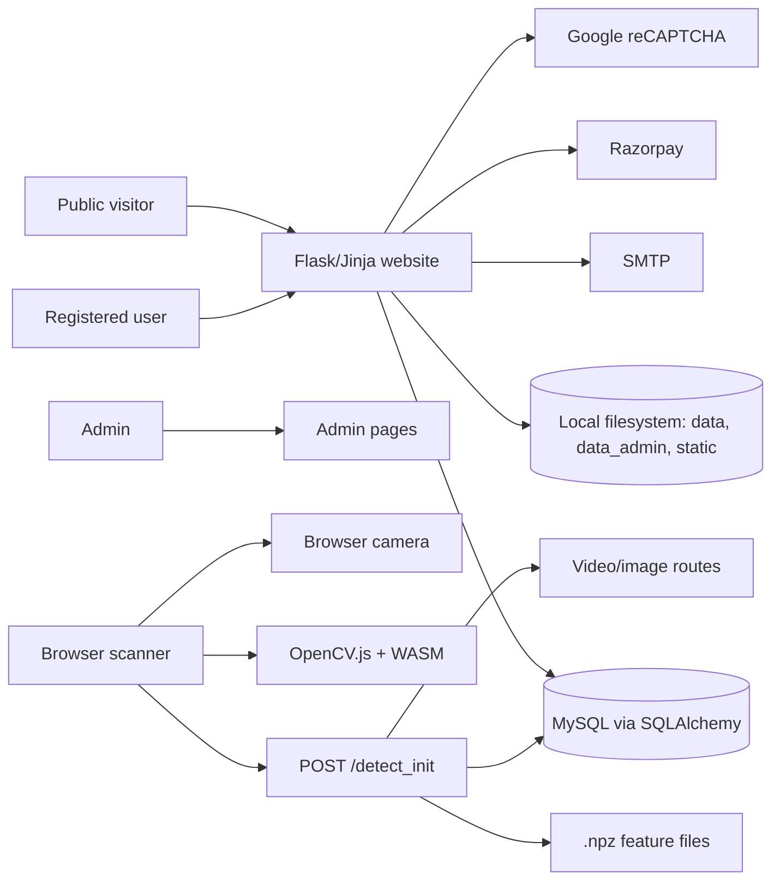

# Project Overview

## What Scan Story Is

Scan Story is a Flask-based web application for creating browser-based AR-like scan experiences. A creator uploads one or more image/video pairs into a `Project`; the system generates a QR code that opens a scanner page. When a viewer opens the scanner, points the camera at the uploaded reference image, and the system recognizes it, the matching video is warped over the camera view.

Confirmed evidence:

- `Project` and `ProjectPair` models define named projects with image/video pairs: `models.py:464`, `models.py:493`.
- User uploads create image/video pairs and QR codes: `app.py:2633` to `app.py:2893`.
- Admin uploads create similar projects in admin-specific folders: `app.py:5335` to `app.py:5564`.
- Scanner page is served by `/scanner/<project_id>`: `app.py:3213`.
- Detection and tracking use `/detect_init` and browser-side optical flow: `app.py:3262`, `templates/user/scanner.html:1222`.

## System Architecture

## Major Modules

- Public website: landing, blog, pricing, contact, legal pages.
- Authentication: user registration, email OTP verification, login, logout, forgot/reset password.
- Subscription/payment: free trial, Basic/Pro plans, Razorpay order creation and verification.
- Story/project creation: authenticated users and admins upload image/video pairs.
- QR generation: QR links point to scanner pages with user/admin owner context in query parameters.
- Scanner: camera stream, OpenCV.js tracking, server detection endpoints.
- Admin: users, plans, payments, subscriptions, scans, settings, projects, admins, activity logs.

## Understanding Status

Repository source is sufficiently understood for optimization planning, with important unknowns around production deployment, actual traffic, production database size, and real scanner accuracy/performance.

