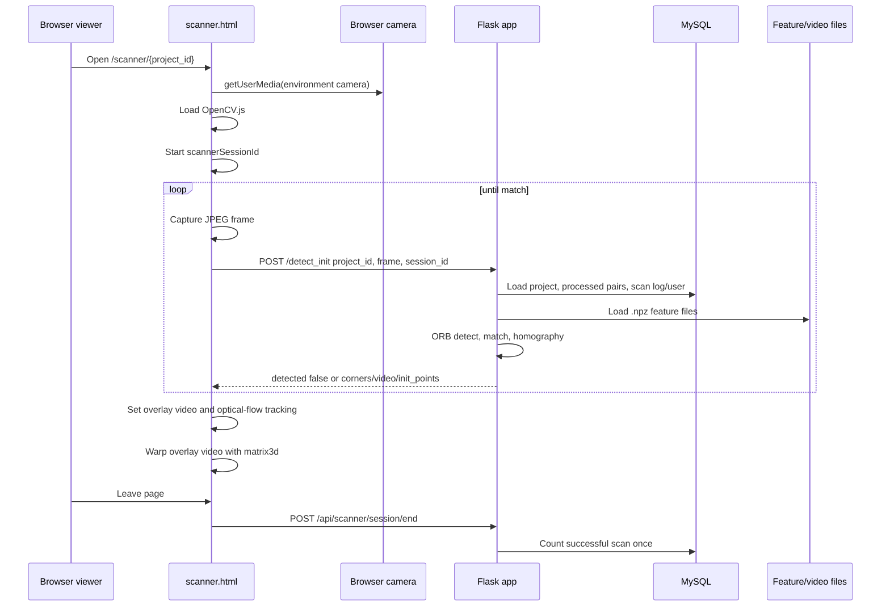

# Scanner Workflow

## Scanner Sequence



## Lifecycle

1. Flask renders `templates/user/scanner.html` from `/scanner/<project_id>` at `app.py:3213`.
2. The route loads `Project`, owner data, and passes project identity to the template.
3. Browser creates a scanner session UUID in `scanner.html`.
4. Browser checks secure context and requests camera via `navigator.mediaDevices.getUserMedia`.
5. Browser loads `static/js/opencv.js`; `static/js/opencv_js.wasm` is service-worker cached by `static/sw.js`.
6. The JS periodically captures a JPEG frame to a hidden canvas.
7. `detectOnceFromServer()` posts `project_id`, `test_image`, and optional `scan_session_id` to `/detect_init`.
8. Flask decodes the image, computes ORB features, loads stored `.npz` descriptors, matches candidate pairs, computes homography and corners.
9. If detected, Flask returns `video_url`, `corners`, `init_points`, frame size, inlier count, and matched pair id.
10. Browser sets overlay video source and uses OpenCV.js `calcOpticalFlowPyrLK` to track the detected quadrilateral between server detections.
11. Browser warps the overlay video with CSS `matrix3d`.
12. On page unload, browser posts or beacons `/api/scanner/session/end`.

## `/detect_init`

- Route: `app.py:3262`.
- Input: multipart form with `project_id`, `test_image`, optional `scan_session_id`.
- DB reads/writes: `Project`, processed `ProjectPair`, `ScanLog`, `User`.
- Files read: `.npz` feature files via `load_features`.
- CPU operations: `cv2.imdecode`, resize, YUV equalization, ORB detect/compute, BFMatcher KNN, homography, good features to track.
- Success output: `detected=true`, `matched_pair_id`, `video_url`, `corners`, `init_points`, `frame_width`, `frame_height`, `variant`, `inliers`, `scan_session_id`.
- Failure output: `detected=false` with `reason`, sometimes progress counts.

## `/detect_track`

- Route: `app.py:3750`.
- Input: multipart form with `project_id`, `pair_id`, `test_image`, optional `scan_session_id`.
- Purpose: server-side tracking/matching for a known pair. The current frontend mainly uses browser-side optical flow and `/detect_init` re-anchors.
- Output: `ok=true` with `corners`, frame dimensions, variant and inliers, or `ok=false` with reason.

## Scanner State Locations

- Browser local JS: current pair id, video URL, tracking state, corners, optical-flow points, scanner session UUID.
- Flask session: `user_id` can be set from QR query parameters in `app.py:3229`.
- Python memory: thread-local ORB objects, cached feature files, logo cache.
- Database: scan logs and counted status.
- Filesystem: uploaded reference images, videos, `.npz` features.

## Scanner Data Flow

```mermaid
flowchart LR
  CameraFrame[Camera frame JPEG] --> DetectInit[/detect_init]
  DetectInit --> Decode[cv2 decode + resize]
  Decode --> ORB[ORB descriptors]
  FeatureFiles[Project .npz features] --> Match[quick_score + match_best_variant]
  ORB --> Match
  Match --> Homography[findHomography + valid corners]
  Homography --> JSON[video_url + corners + init_points]
  JSON --> BrowserTrack[OpenCV.js optical flow]
  BrowserTrack --> Overlay[Warped video overlay]
```

