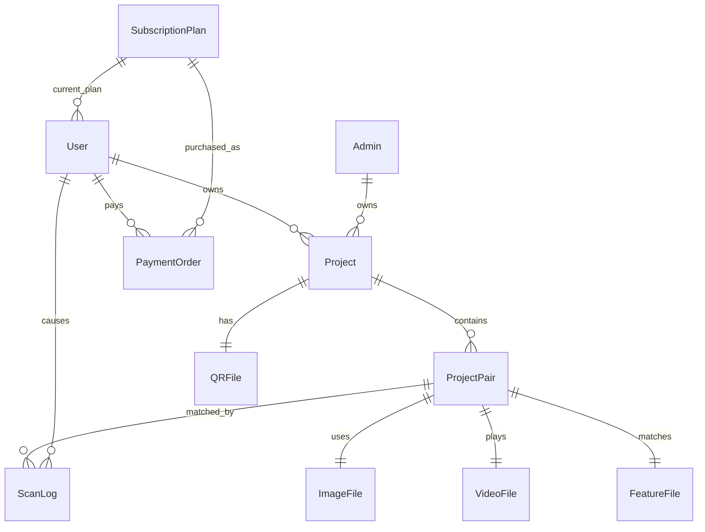

# Computer-Vision Data Flow

## Reference Data Creation

User upload route `handle_upload` creates `ProjectPair` rows and writes:

- image: `data/images/{project_id}_{pair_index}.jpg`
- video: `data/videos/{project_id}_{pair_index}.{ext}`
- feature file: `data/features/{project_id}_{pair_index}.npz`

Admin upload route writes the same pattern under `data_admin/images`, `data_admin/videos`, and `data_admin/features`.

## Feature Generation

`extract_features_multi` at `app.py:1148`:

- reads target image with OpenCV.
- enhances it for ORB.
- converts to grayscale.
- creates variants: normal, flipped X, flipped Y, flipped XY, rotated 90, rotated 270.
- computes ORB keypoints/descriptors.
- maps variant keypoints back to original coordinate space.
- stores descriptor/keypoint arrays plus image width/height in `.npz`.

## Feature Loading

`load_features` at `app.py:1193`:

- checks whether project is admin-owned.
- chooses `ADMIN_FEATURES_DIR` or `FEATURES_DIR`.
- loads `.npz` with NumPy.
- returns descriptor/keypoint arrays for all feature tags.
- is cached with `@lru_cache(maxsize=2048)`.

## Data Relationship Map

## Staleness And Persistence

Feature files are essential to detection. They can become stale if image files are replaced without regeneration. Edit and reprocess routes call feature extraction again and clear the `load_features` cache (`app.py:2182`, `app.py:2255`, `app.py:2872`, `app.py:5548`).

