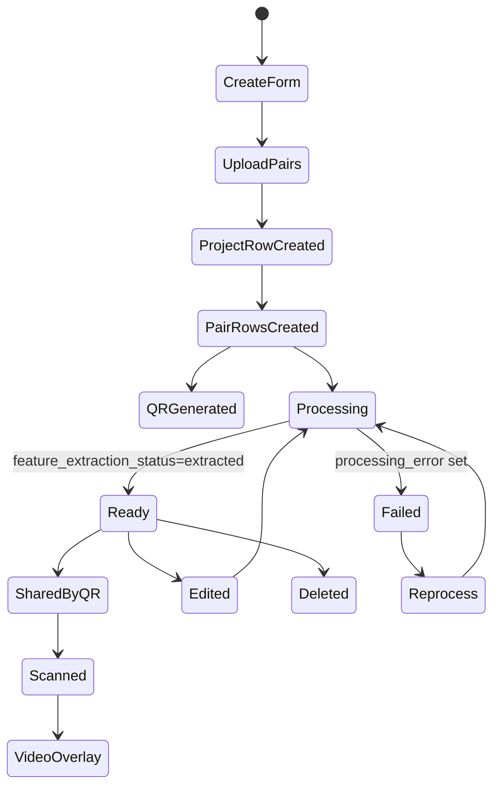

# Story Content Lifecycle

## What "Story" Means

In source code, the durable content object is called `Project`, not `Story`. A project contains one or more `ProjectPair` rows. Each pair links one reference image to one overlay video. The user-facing text calls these "stories" or AR memories.

## Lifecycle

## Creation

- User creation form: `/create-project`, `templates/user/user_create_project.html`.
- User POST: `/upload`, `app.py:2633`.
- Admin creation form: `/admin/projects/create`, `app.py:5335`.
- Admin POST: `/admin/projects/upload`, `app.py:5348`.

## Content Types

Confirmed uploaded media:

- Reference images.
- Overlay videos.

No durable text/audio/link story content model was found beyond project name/description and the image/video pairs.

## Ownership

- User-owned projects have `Project.owner_user_id`.
- Admin-owned projects have `Project.owner_admin_id`.
- Separate filesystem directories are used for admin and user media.

## Viewing

Project creators see success/project/preview pages. Scanner viewers see the camera page and overlay video after recognition.

