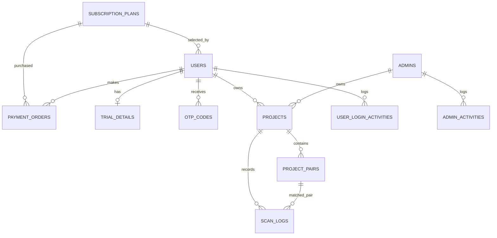

# Database Architecture

See `database-model-inventory.csv` for model inventory.

## Main Models

- `SubscriptionPlan`: plan pricing, duration, project/scan limits, max pairs per project.
- `User`: customer account, subscription status, usage counters, password hash.
- `TrialDetails`: trial period and trial conversion metadata.
- `PaymentOrder`: Razorpay order/payment/subscription purchase record.
- `OTPCode`: email verification/reset OTP.
- `Admin`: admin account and permissions JSON.
- `Project`: story/project container and QR metadata.
- `ProjectPair`: image/video pair and processing status.
- `ScanLog`: scan session recognition/counting record.
- `UserLoginActivity`: successful/failed login attempts.
- `AdminActivity`: admin action audit log.
- `SystemConfig`: key/value admin settings.

## Relationship Diagram

## `db.create_all()` Calls

- Import-time call: `app.py:239` runs inside `with app.app_context()` during module import. It creates missing tables and inserts default plans/admin/config when empty.
- Main-only call: `app.py:5762` runs only when executing `python app.py`, then calls `bootstrap_database()` before Flask dev server starts.

No raw SQL was found in active route code. Operations use SQLAlchemy ORM and `db.session.commit()`.

