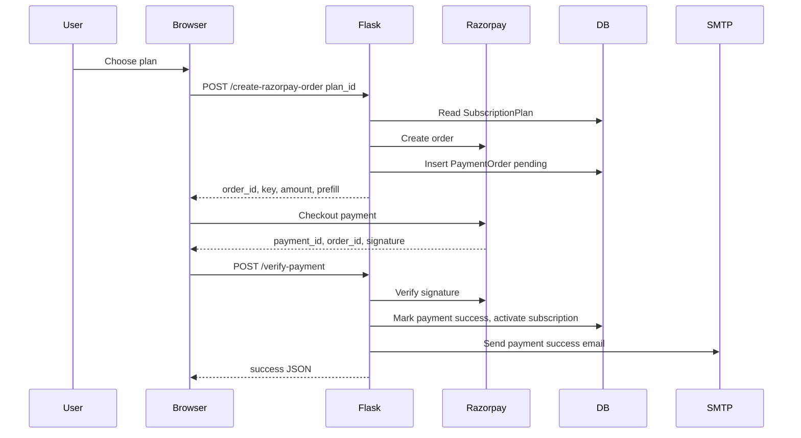

# Payment Workflow

## What Users Pay For

Users pay for subscription plans (`SubscriptionPlan`) that grant project and scan limits. Plans are shown on `/pricing` and `/subscribe`.

## Payment Sequence

## Confirmed Behavior

- Razorpay keys come from `RAZORPAY_KEY_ID` and `RAZORPAY_KEY_SECRET`: `app.py:195`.
- Client is initialized during startup if both keys exist: `app.py:201`.
- Order creation route: `app.py:2945`.
- Payment amount uses `plan.effective_price * 100` paise.
- `PaymentOrder` is inserted as `pending`.
- Verification route: `app.py:3040`.
- Signature verification uses `razorpay_client.utility.verify_payment_signature`.
- Success updates `PaymentOrder`, resets user counters, marks subscription active, updates trial conversion, and sends email.

## Missing Or Not Found

- No Razorpay webhook route was found.
- Refund/cancellation workflow is not implemented in active routes, though `PaymentOrder.status` allows `refunded`.
- Duplicate payment idempotency beyond matching `razorpay_order_id` was not evident.

