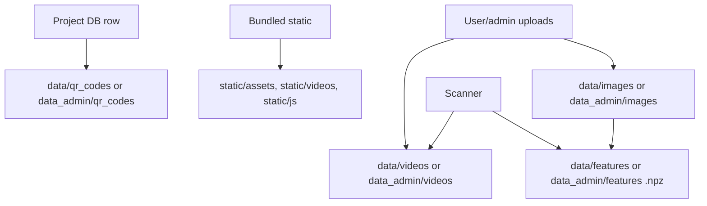

# Files, Media And Persistence

## Persistence Diagram

## Classification

See `filesystem-persistence-map.csv`.

## Naming Conventions

- User images: `{project.id}_{pair_index}.jpg`.
- User videos: `{project.id}_{pair_index}{original_ext_or_mp4}`.
- User features: `{project.id}_{pair_index}.npz`.
- User QR: `project_{project.id}_main.png`.
- Admin QR: `project_{project.id}_admin.png`.

## Upload Limits

- Images: `MAX_IMAGE_SIZE = 50 MB`, `app.py:716`.
- Videos: `MAX_VIDEO_SIZE = 1 GB`, `app.py:717`.

## Cleanup

`_delete_project_files_and_rows` removes image/video/feature files and QR for user-style directories, then deletes DB rows and clears feature cache. Admin own delete calls the same helper, which may be important because admin files live in admin-specific directories.

