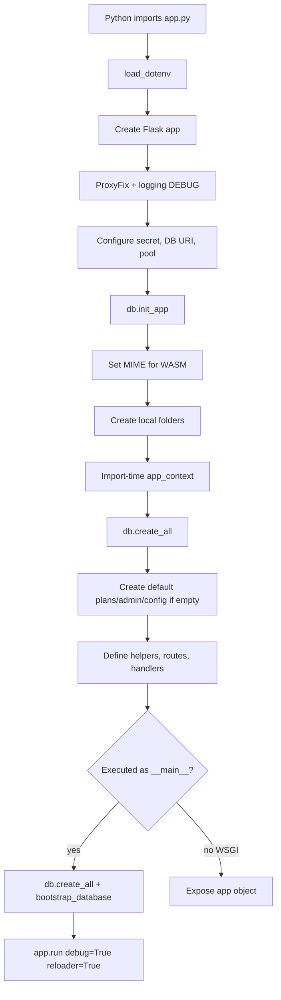

# Application Startup

## Startup Diagram

## Runs Once Per Process

- env loading, app creation, DB config, folder creation, Razorpay client init, route registration.
- import-time `db.create_all()` and default bootstrap block.
- global caches/objects: `_fast_bf`, `_tls`, logo cache, `load_features` cache.

## Runs Per Request

- before/after request logging.
- route DB lookups and template rendering.
- scanner detection CV work.

## Debug Reloader Consideration

When run as `python app.py`, Flask debug reloader can start app code more than once. This matters because import-time bootstrap and main-time bootstrap both exist.

