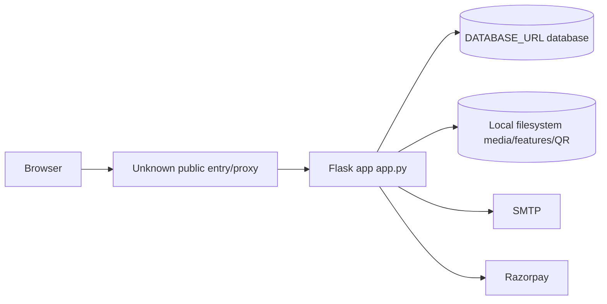

# Current Deployment Understanding

## Confirmed From Repository

- `gunicorn` is listed in `requirements.txt`.
- Flask dev server entry exists: `app.py:5758` to `app.py:5768`.
- No Dockerfile/compose file found.
- No nginx/apache/systemd/supervisor/Procfile found.
- Static files and uploads have Flask `send_from_directory` routes.
- `.env` is expected via `load_dotenv()` at startup.
- HTTPS likely terminates outside Flask if production uses HTTPS, but no proxy config is present.

## Current Deployment Diagram

## Unknown From Repository

- Actual production start command.
- Whether nginx/reverse proxy exists.
- Whether DB is on same server.
- Whether static/media are served by Flask or proxy in production.
- How logs, restarts, TLS and backups are handled.

