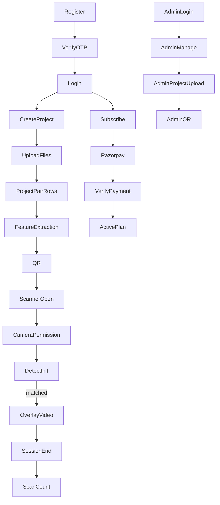

# Critical Business Flows

Full flow map: `critical-flow-map.csv`.

## Must Continue Working

1. Public visitor opens landing/pricing/blog/contact.
2. User registration with reCAPTCHA, OTP email, verification, and login.
3. Trial/paid user creates project with equal image/video pairs.
4. Project generates QR and scanner URL.
5. Background feature extraction marks pairs ready.
6. Scanner opens from QR, requests camera, detects image, overlays matching video.
7. Scanner session end counts one successful scan.
8. User pays through Razorpay and receives plan limits.
9. Admin logs in and manages users/plans/projects/payments/scans/settings.
10. Admin creates admin-owned project with separate admin media paths.

## Flow Diagram

