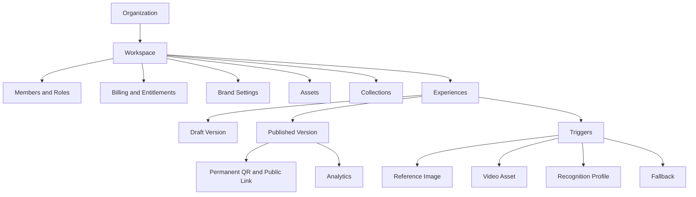

# Release 1 Product Definition

Scan Story Release 1 is a browser-based immersive Experience SaaS. It connects printed or displayed images to digital video content through permanent QR links and camera-based image recognition.

Release 1 is deliberately narrow: **image-triggered video Experiences only**. No 3D, object recognition, face/body tracking, location AR, WebXR, VR, native app, marketplace, or public SDK ships in this release.

## Product Promise

Creators upload a reference image and a matching video, publish an Experience, then share one stable QR/public link. Viewers open the link in a browser, allow camera access, scan the printed image, and see the video overlay anchored to that image. If scanning is not possible, the viewer still gets a useful fallback.

## Product Hierarchy

## Non-Negotiable Principles

- No dashboard or scanner load increase unless the feature is active.
- Scanner assets are lazy-loaded only for viewers.
- Published Experiences must not break.
- Heavy work runs async outside web requests.
- APIs and recognition contracts are versioned.
- Every published Experience has fallback.
- Features are gated by flags and entitlements.
- System behavior is observable, testable, and reversible.

