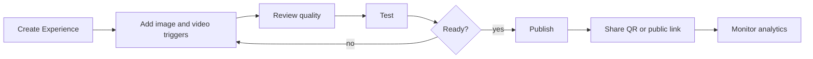

# Creator User Journey

## Required Flow

1. Creator creates a draft Experience.
2. Creator uploads reference image and matching video for each trigger.
3. System validates file type, size, resolution, duration, codec, and tenant limits.
4. System processes media and recognition artifacts async.
5. Creator sees marker quality, warnings, and processing status.
6. Creator tests scanner behavior before publishing.
7. Publisher role or owner approves publication if approval workflow is enabled.
8. Published QR/link points to immutable published version.

## Failure Handling

Creators must see plain remediation when processing fails: replace image, replace video, retry, lower video size, improve print target, or contact support.

