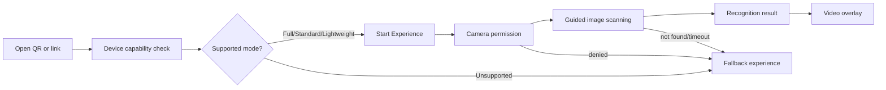

# Viewer User Journey

## Viewer Requirements

- No account required for public Experiences.
- Loading states must show progress and recovery paths.
- Camera permission is requested only when needed.
- Scanner mode adapts to capability, memory, network, browser, codec, and reduced-motion settings.
- Fallback is always reachable.

## Viewer Success

Viewer reaches either the anchored video overlay or a useful fallback within a bounded time, with no dead-end loading screen.

