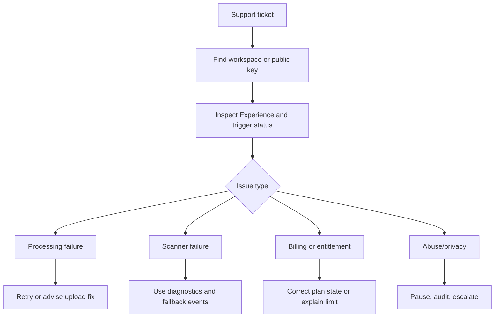

# Admin And Support Journey

## Admin Jobs

- Inspect user, workspace, plan, entitlement, and billing state.
- View Experience status, trigger status, processing job history, and publication history.
- Diagnose scanner startup failures by browser/device/error code.
- Retry safe failed jobs with idempotency.
- Pause or archive abusive or broken Experiences.
- Export support-safe diagnostics without camera images or biometric data.

## Support Journey

## Boundaries

Support tools must not expose raw private uploads beyond role permission. Public scanner diagnostics must be sanitized.

