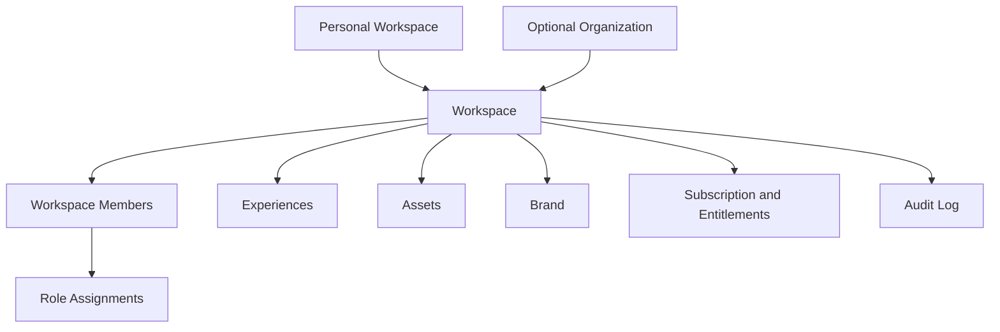

# Workspace And Organization Model

Revision 1 approved rule: **Workspace is required in Release 1; Organization is optional**.

Every new account receives a default personal Workspace. Existing Users are backfilled into one personal Workspace, and existing Projects are assigned to that Workspace through additive compatibility mapping. Ordinary creators must not be forced through enterprise Organization setup.

Workspaces own Experiences, members, roles, assets, brand settings, billing context, analytics, and limits. An Organization may later own multiple Workspaces for enterprise or agency customers.

## Roles

- Owner: full control.
- Workspace Admin: workspace configuration and members.
- Creator: draft creation and uploads.
- Reviewer: review and comment.
- Publisher: publish, pause, rollback.
- Analyst: analytics access.
- Billing Admin: plan, invoices, payment.
- Viewer: public or restricted viewing.

## Release 1 UI Simplification

The interface may expose fewer role presets at first, but the data model should support the full role set.

## Revision 1 Ownership Rules

Decision status: Approved Release 1 rule.

- Workspace owner: the account or role with full control over members, Experiences, publication, transfer, and billing delegation.
- Billing Administrator: manages plan, payment method, invoices/references, entitlements, and overage policy for the Workspace.
- Membership: Users join Workspaces through explicit membership records. A User may later belong to multiple Workspaces.
- Billing ownership: Billing Account belongs to Workspace. Current User subscription fields remain supported during migration until backfill and compatibility validation complete.
- Ownership transfer: must be explicit, authorized by Owner or platform support policy, and audited.
- Account deletion: must consider Workspace ownership, transfer, retention, published Experience availability, and billing state before deleting user-owned data.
- Admin-created Experiences: no content may remain ambiguously owned by an Admin record; admin/staff work must be assigned to a customer Workspace or managed-service Workspace.
- Managed-service Experiences: staff may create on behalf of a customer, but ownership, publishing authority, transfer, and audit trail must be explicit.

## Canonical Terminology

Decision status: Approved Release 1 rule.

| Legacy term | Target product term | Rule |
|---|---|---|
| Project | Experience | Legacy code/routes may continue using Project temporarily. Creator-facing Release 1 moves toward Experience. |
| ProjectPair | Trigger | Legacy model maps to Trigger. |
| Scan | Context-dependent legacy metric | APIs must not use `scan` ambiguously for launch, detection, and billing events. |
| Experience View | Billable viewer launch | Billing unit. |
| Recognition Attempt | Non-billable detection attempt | Detection frames/requests are not billable. |
| Scanner Session | One scanner runtime session | Groups launch, attempts, fallback, and events. |
