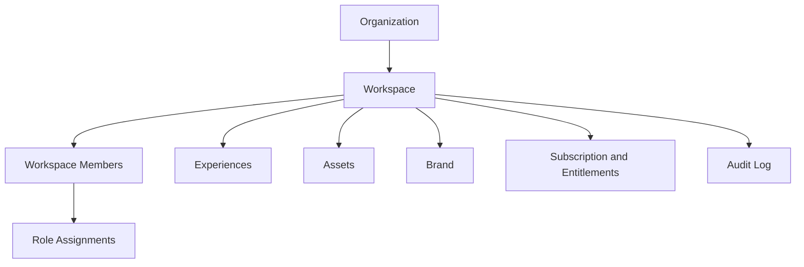

# Workspace And Organization Model

Organizations own workspaces. Workspaces own Experiences, members, roles, assets, brand settings, billing context, analytics, and limits.

## Roles

- Owner: full control.
- Workspace Admin: workspace configuration and members.
- Creator: draft creation and uploads.
- Reviewer: review and comment.
- Publisher: publish, pause, rollback.
- Analyst: analytics access.
- Billing Admin: plan, invoices, payment.
- Viewer: public or restricted viewing.

## Release 1 UI Simplification

The interface may expose fewer role presets at first, but the data model should support the full role set.

