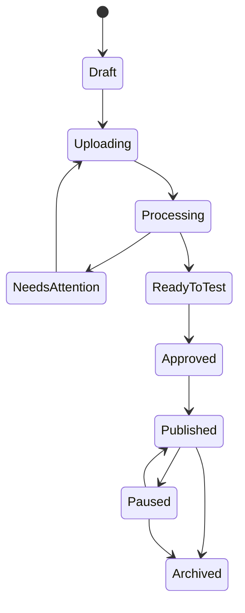

# Experience Lifecycle

## State Rules

- Draft: editable.
- Uploading: assets are being received.
- Processing: async media and recognition jobs are running.
- Needs Attention: one or more triggers require creator action.
- Ready To Test: all required trigger artifacts are ready.
- Approved: publication allowed.
- Published: immutable public version.
- Paused: public link shows unavailable or fallback policy.
- Archived: no new public sessions.

## Versioning

Publishing atomically switches the permanent QR/link to a published version. Rollback restores an earlier published version without changing the QR.

