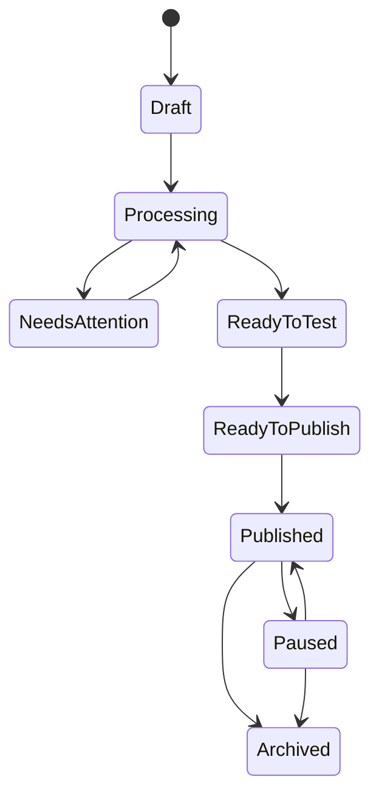

# Experience Lifecycle



## State Rules

- Draft: editable.
- Processing: async media and recognition jobs are running.
- Needs Attention: one or more triggers require creator action.
- Ready To Test: all required trigger artifacts are ready.
- Ready To Publish: publication gates pass. Approval may be required only if approval workflow is enabled.
- Published: immutable public version.
- Paused: public link shows unavailable or fallback policy.
- Archived: no new public sessions.

## Versioning

Publishing atomically switches the permanent QR/link to a published version. Rollback restores an earlier published version without changing the QR.

## Revision 1 Canonical Lifecycle

Decision status: Approved Release 1 rule.

Experience lifecycle:

```text
Draft -> Processing -> Needs Attention -> Ready to Test -> Ready to Publish -> Published -> Paused -> Archived
```

Approval is optional and exists only when approval workflow is enabled by entitlement or Workspace policy. Editing a Published Experience creates a new Draft Version. Published Versions are immutable. Rollback restores an earlier Published Version through the permanent link. Archive does not delete assets immediately. Delete is a separate retention-governed operation requiring authorization, audit, and compatibility review.
