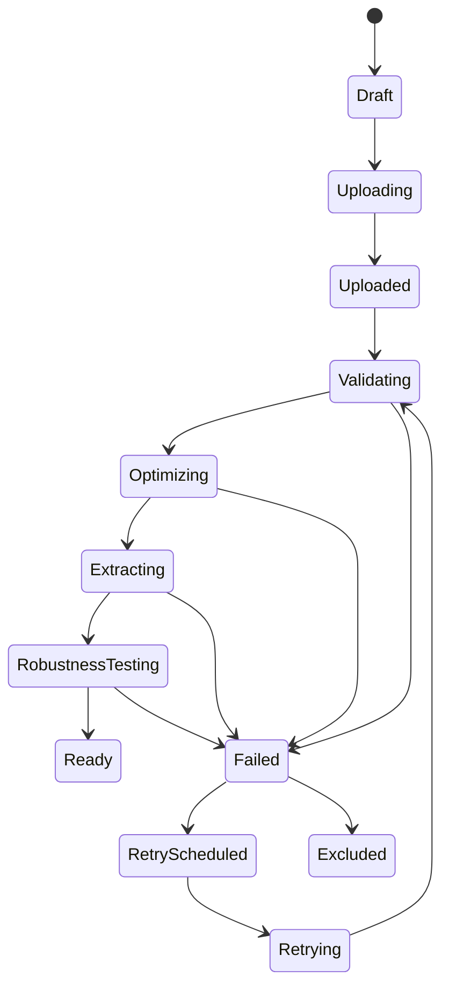
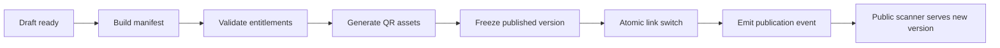

# Processing And Publishing Model



## Job Record Requirements

Each processing job records job ID, trigger ID, operation type, status, attempts, progress, timings, failure category, sanitized message, diagnostics, processing version, algorithm version, and idempotency key.

## Publishing Flow



No unmanaged daemon threads. Durable queues own processing.

## Revision 1 Canonical Trigger Lifecycle

Decision status: Approved Release 1 rule.

Trigger lifecycle:

```text
Draft -> Uploading -> Validating -> Optimizing -> Extracting -> Robustness Testing -> Ready
```

Failure states:

```text
Failed -> Retry Scheduled -> Retrying
Failed -> Excluded
```

## QR Timing Rule

Decision status: Approved Release 1 rule.

Legacy Projects may already create QR at upload time. Release 1 target publishing creates or activates the permanent Experience public key at publication. The compatibility resolver must preserve existing QR behavior while the new publishing model atomically switches the public key to the current Published Version.
