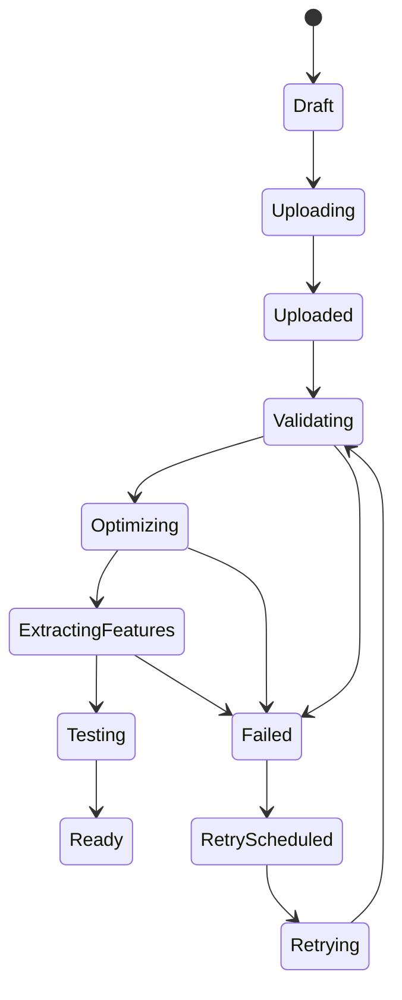
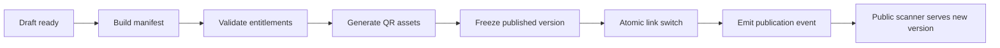

# Processing And Publishing Model

## Job Record Requirements

Each processing job records job ID, trigger ID, operation type, status, attempts, progress, timings, failure category, sanitized message, diagnostics, processing version, algorithm version, and idempotency key.

## Publishing Flow

No unmanaged daemon threads. Durable queues own processing.

