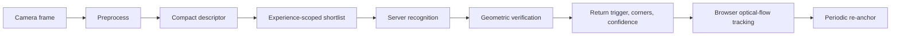

# Recognition And Quality Strategy

Release 1 preserves the current recognition concept: server-side initial recognition, geometric verification, browser-side optical-flow tracking, and periodic re-anchoring.

## Marker Quality Inputs

Resolution, aspect ratio, compression, blur, brightness, exposure, contrast, repeated patterns, feature distribution, blank areas, glare, text density, crop risk, and print suitability.

## Robustness Tests

Brightness, darkness, contrast, blur, noise, JPEG compression, scale, rotation, perspective, crop, occlusion, and color temperature.

## Quality Classes

Excellent, Good, Acceptable with warnings, Weak, Unsupported.

## Recognition Contract

Response includes detection result, trigger ID, content URL, corners, tracking points, confidence, frame dimensions, scanner session ID, diagnostics code, and contract version.

## Revision 1 Recognition Gates

Decision status: Approved Release 1 rule.

Marker quality gate:

- Minimum usable resolution: configurable; must be measured before final threshold.
- Blur threshold: configurable; calibrated from test set.
- Brightness range: configurable; calibrated for print and screen-displayed targets.
- Feature count: required metric; threshold configurable.
- Feature distribution: required metric; warns on clustered features.
- Repetitive-pattern warning: required.
- Blank-area warning: required.

Robustness-test gate must test brighter, darker, blur, compression, scale, rotation, perspective, crop, and mild occlusion variants.

Runtime gate must measure first-recognition latency, false-positive rate, successful recognition rate, tracking FPS, re-anchor success, and target-loss recovery.

Final numeric thresholds are calibration values, not approved constants, until test data exists.
