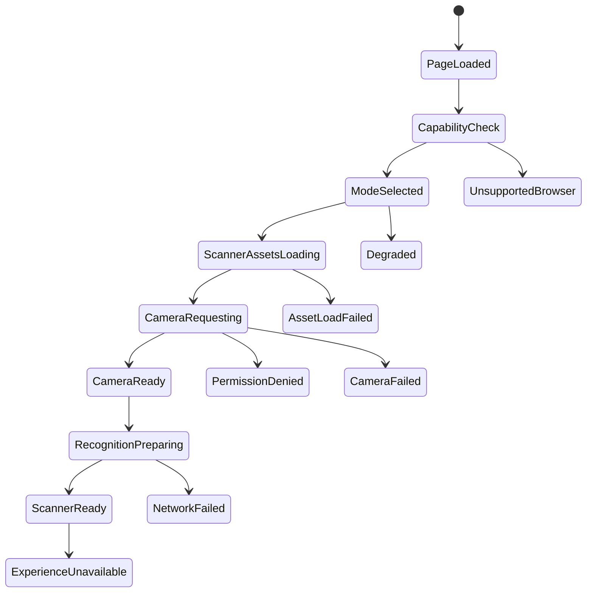

# Mobile And Device Strategy

Scanner modes: Full, Standard, Lightweight, Unsupported.

## Capability Checks

Secure context, media devices, WASM, WebGL, memory, processor count, network, video codec support, browser, OS, and reduced-motion preference.

## State Guarantees

Every loading state has timeout, retry, message, fallback route, diagnostic code, and analytics event.

## Revision 1 Scanner Failure Matrix

Decision status: Approved Release 1 rule.

| Failure | Detection method | Timeout | Retry | Viewer message | Fallback action | Analytics event | Diagnostic code |
|---|---|---:|---|---|---|---|---|
| Camera denied | Permission API/error | Immediate | Prompt settings | Camera permission is blocked. | Open fallback | `camera_denied` | `CAM_DENIED` |
| Camera unavailable | `getUserMedia` error | Immediate | Retry camera | Camera is unavailable. | Open fallback | `camera_unavailable` | `CAM_UNAVAILABLE` |
| Incorrect camera | Device selection/user report | Configurable | Switch camera | Try the other camera. | Continue/fallback | `camera_switch` | `CAM_WRONG` |
| Secure context missing | `window.isSecureContext` | Immediate | None | Secure connection required. | Open fallback | `secure_context_missing` | `SECURE_REQUIRED` |
| Browser unsupported | feature detection | Immediate | None | Browser is not supported. | Open fallback | `browser_unsupported` | `BROWSER_UNSUPPORTED` |
| WebAssembly unavailable | feature detection | Immediate | None | Scanner engine is unavailable. | Open fallback | `wasm_unavailable` | `WASM_UNAVAILABLE` |
| OpenCV load failure | script error/timeout | Configurable | Retry bounded | Scanner engine failed to load. | Open fallback | `opencv_load_failed` | `OPENCV_FAIL` |
| WASM load failure | network/runtime error | Configurable | Retry bounded | Scanner engine failed to load. | Open fallback | `wasm_load_failed` | `WASM_FAIL` |
| Weak device | capability/memory/FPS | Configurable | Lightweight mode | Device may be slow. | Lightweight/fallback | `weak_device` | `DEVICE_WEAK` |
| Low memory | memory/device hints/crash recovery | Configurable | Lightweight mode | Device memory is low. | Lightweight/fallback | `low_memory` | `MEM_LOW` |
| Slow network | network timing | Configurable | Retry assets | Network is slow. | Lightweight/fallback | `network_slow` | `NET_SLOW` |
| Disconnected network | fetch failure/offline | Configurable | Retry | Network disconnected. | Cached fallback if available | `network_offline` | `NET_OFFLINE` |
| Autoplay blocked | video play promise rejection | Immediate | Tap to play | Tap to play video. | Manual play/fallback | `autoplay_blocked` | `VIDEO_AUTOPLAY` |
| Unsupported codec | video error | Immediate | Alternate variant | Video format unsupported. | Fallback video/page | `codec_unsupported` | `VIDEO_CODEC` |
| Device rotated | resize/orientation event | Immediate | Recalibrate | Re-align your device. | Continue/fallback | `device_rotated` | `ORIENTATION_CHANGE` |
| Tab suspended/app backgrounded/incoming call | visibility/page lifecycle | Immediate | Resume | Scanner paused. | Resume/fallback | `scanner_suspended` | `PAGE_SUSPEND` |
| Camera interrupted | track ended/error | Immediate | Reopen camera | Camera was interrupted. | Retry/fallback | `camera_interrupted` | `CAM_INTERRUPTED` |
| Target lost | tracking confidence/loss timer | Configurable | Re-detect | Target lost. Point at the image. | Continue/fallback | `target_lost` | `TARGET_LOST` |
| Detection timeout | no match by timeout | Configurable | Retry scan | Image not found. | Open fallback | `detection_timeout` | `DETECT_TIMEOUT` |
| Experience unavailable/paused/private | resolver status | Immediate | Policy-based | Experience unavailable. | Fallback or access flow | `experience_unavailable` | `EXP_UNAVAILABLE` |
| Media load failure | media error/timeout | Configurable | Retry variant | Media failed to load. | Fallback | `media_load_failed` | `MEDIA_FAIL` |

No state may leave the viewer on an endless loader.
