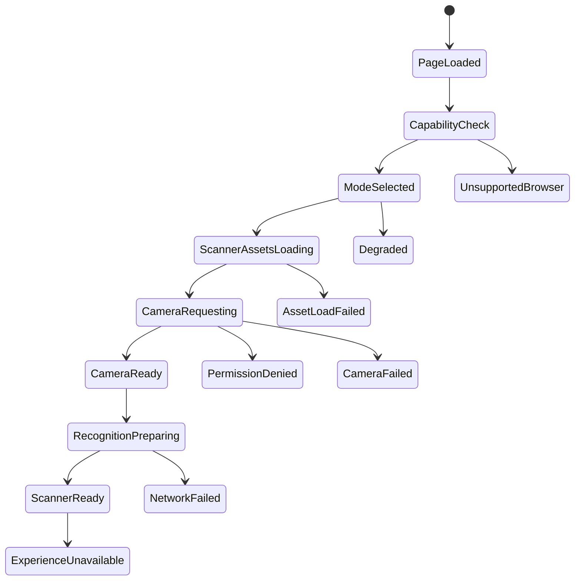

# Mobile And Device Strategy

Scanner modes: Full, Standard, Lightweight, Unsupported.

## Capability Checks

Secure context, media devices, WASM, WebGL, memory, processor count, network, video codec support, browser, OS, and reduced-motion preference.

## State Guarantees

Every loading state has timeout, retry, message, fallback route, diagnostic code, and analytics event.

