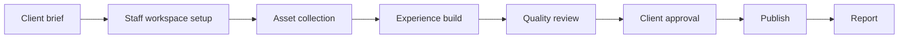
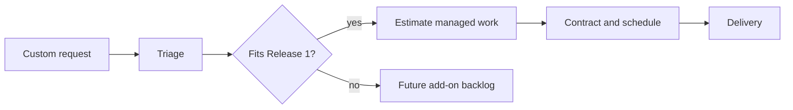

# Managed Service And Custom Solutions

Managed service lets Scan Story staff create, test, publish, and monitor Experiences for clients.

## Custom Request Workflow

Managed access is entitlement-gated and auditable.

## Revision 1 Managed-Service Ownership

Decision status: Approved Release 1 rule.

M Pro9/Scan Story staff may create an Experience on behalf of a customer. The Experience must belong to either the customer Workspace or a managed-service Workspace with explicit contractual ownership. Publishing authority, transfer, and support access must be explicit and audited. No customer content may remain ambiguously owned by an administrator account. Customer content ownership is contractual; reusable platform IP remains owned by Scan Story/M Pro9.
