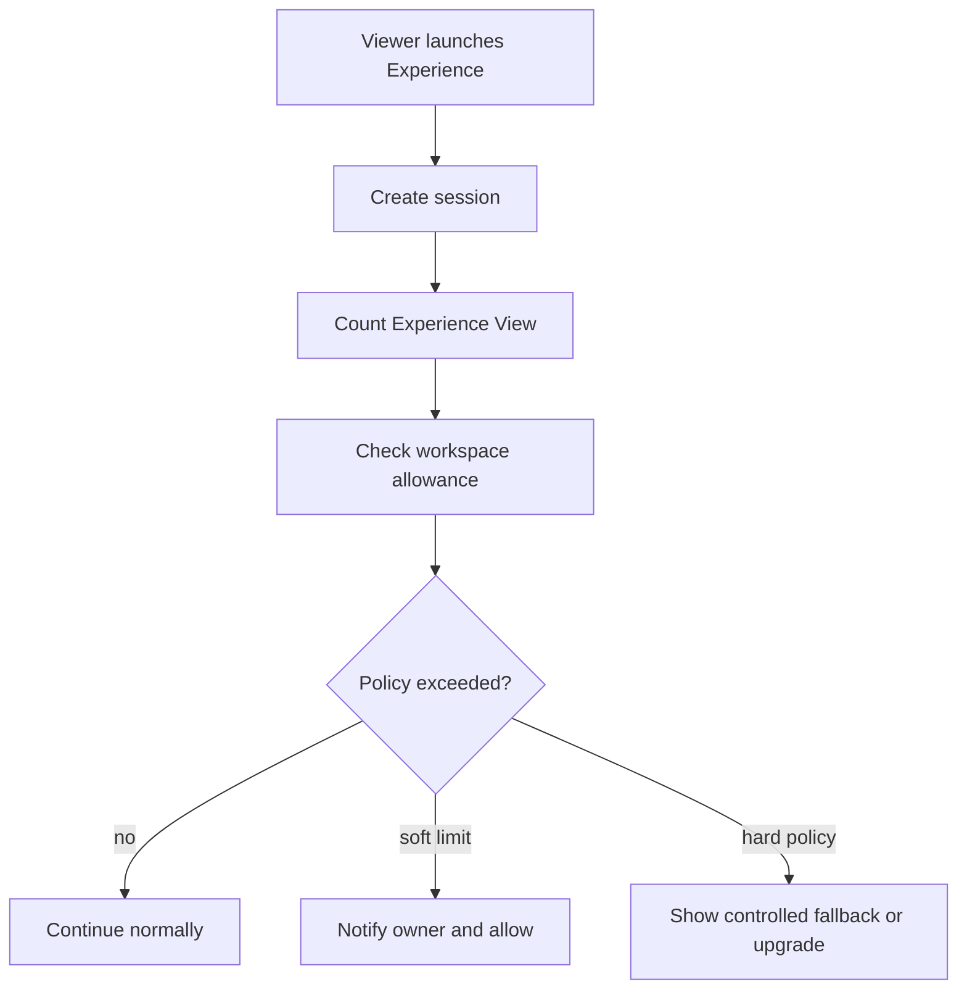

# Billing And Usage Metering

The primary billable usage unit is **Experience View**: one viewer launch of an Experience.

Do not bill every camera frame, recognition request, or server call.

## Additional Metering

Active Experiences, triggers, storage, bandwidth, media-processing minutes, seats, future API usage, and future 3D usage.

## Billing Reliability

Payment operations require idempotency. Webhook-ready billing state must be separate from public scanner availability.

