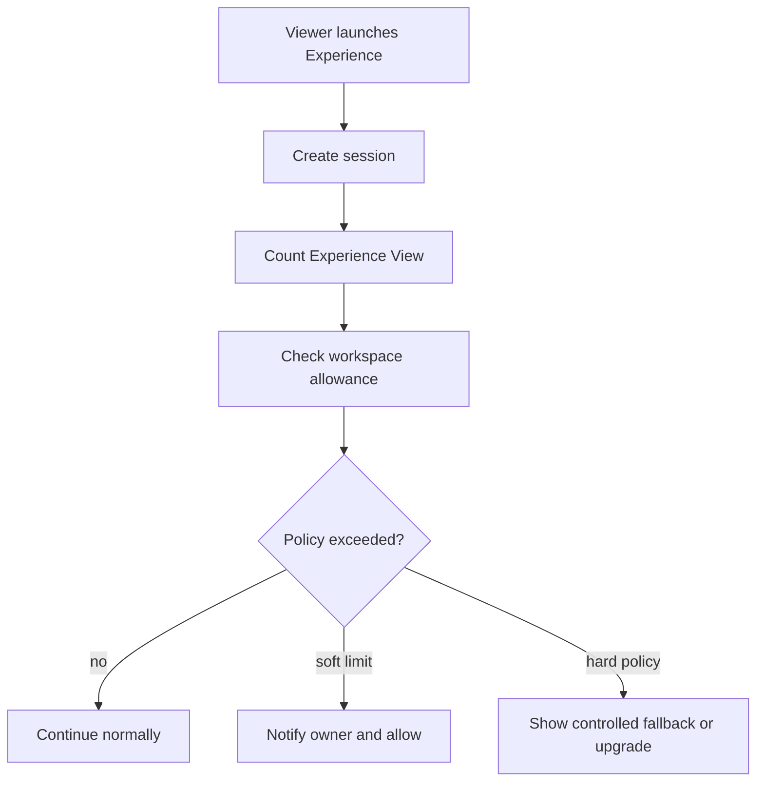

# Billing And Usage Metering

The primary billable usage unit is **Experience View**: one viewer launch of an Experience.

Do not bill every camera frame, recognition request, or server call.

## Additional Metering

Active Experiences, triggers, storage, bandwidth, media-processing minutes, seats, future API usage, and future 3D usage.

## Billing Reliability

Payment operations require idempotency. Webhook-ready billing state must be separate from public scanner availability.

## Revision 1 Canonical Billing Rules

Decision status: Approved Release 1 rule unless marked configurable.

- Billing Account belongs to Workspace.
- One Experience View equals one viewer launch within the configured session window.
- Recognition attempts are non-billable.
- Detection frames are non-billable.
- Fallback launch counts as an Experience View because the Experience was opened.
- Repeated detection requests inside one Scanner Session do not create extra Experience Views.
- Session-window duration is configurable policy.
- Internal creator preview and automated testing are excluded from billing.
- Usage records are append-only.
- Limits come from entitlements.
- Legacy User subscription remains temporarily supported during migration.
- Razorpay remains the initial payment provider.
- Webhook-ready idempotent payment design is required.
- Final prices and allowance values remain configurable.
