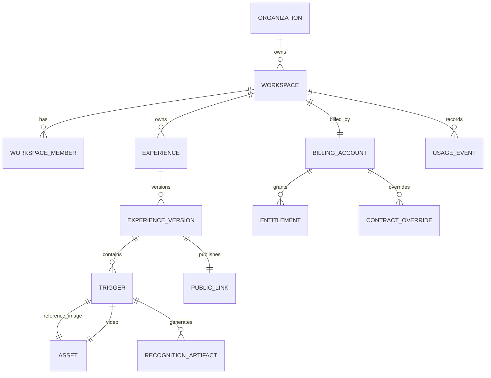

# Data Model Proposal

## Core Tables

Organization, Workspace, WorkspaceMember, RoleAssignment, BillingAccount, Subscription, Entitlement, ContractOverride, Experience, ExperienceVersion, Trigger, Asset, RecognitionArtifact, ProcessingJob, PublicLink, QRAsset, ScannerSession, ExperienceView, RecognitionEvent, UsageRecord, AuditLog.

## Current-To-Target Mapping

User becomes Workspace Member. Project becomes Experience. ProjectPair becomes Trigger. Image file becomes Reference Asset. Video file becomes Content Asset. `.npz` feature becomes Recognition Artifact. Project QR becomes Permanent Experience Link and QR. ScanLog becomes Experience Session plus Recognition Event.

## Revision 1 Additive Model Rules

Decision status: Approved Release 1 rule.

No destructive rename in the first migration. New tables and nullable compatibility fields wrap existing `User`, `Project`, `ProjectPair`, `ScanLog`, payment, and subscription records. Legacy IDs remain queryable. Workspace is required; Organization is optional. BillingAccount belongs to Workspace. UsageRecord is append-only. RecognitionArtifact records algorithm version and may point to existing `.npz` files until regenerated safely.
