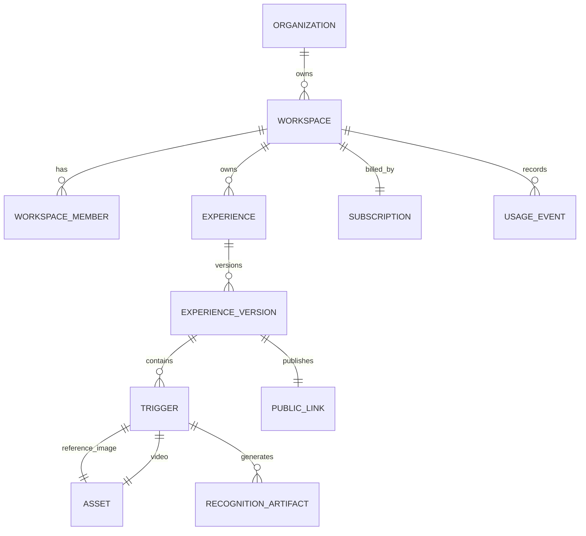

# Data Model Proposal

## Core Tables

Organization, Workspace, WorkspaceMember, RoleAssignment, Subscription, Entitlement, Experience, ExperienceVersion, Trigger, Asset, RecognitionArtifact, ProcessingJob, PublicLink, QRAsset, ScannerSession, RecognitionEvent, UsageEvent, AuditLog.

## Current-To-Target Mapping

User becomes Workspace Member. Project becomes Experience. ProjectPair becomes Trigger. Image file becomes Reference Asset. Video file becomes Content Asset. `.npz` feature becomes Recognition Artifact. Project QR becomes Permanent Experience Link and QR. ScanLog becomes Experience Session plus Recognition Event.

