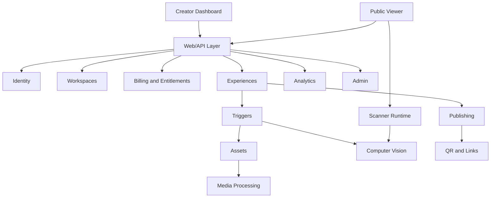
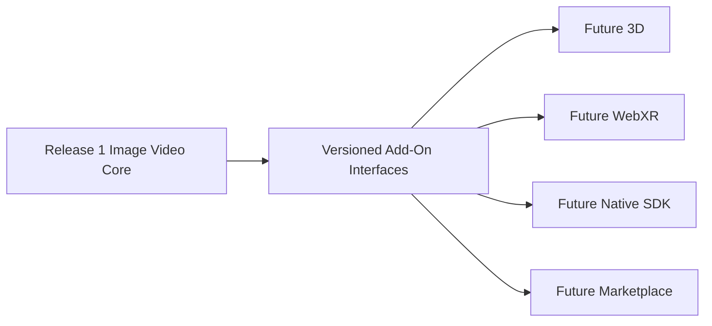

# API And Module Boundaries

Release 1 can remain a modular Flask app. It does not need microservices. It does need clear service interfaces.



## Future Add-On Isolation



The scanner, recognition, publishing, entitlement, and analytics contracts must be versioned so future add-ons do not rewrite the core.

## Revision 1 Versioned Scanner API

Decision status: Approved Release 1 rule.

Legacy scanner API remains supported. The legacy frontend continues receiving the existing `/detect_init` and `/detect_track` response format. New scanner clients use explicit versioned routes; scanner contract changes must not be introduced silently.

Proposed route family:

```text
/api/v1/experiences/{public_key}/scanner-session
/api/v1/experiences/{public_key}/detect
/api/v1/scanner-sessions/{session_id}/events
```

Versioned detection response contract includes schema version, Experience ID/public key, Trigger ID/public key, media URL, corners, tracking points, frame width, frame height, confidence, recognition-artifact version, scanner-session ID, viewer-safe status code, diagnostic code, and retry guidance.

Deprecation requires documented compatibility period, regression tests, customer communication when printed QR behavior could be affected, and explicit leadership approval.
