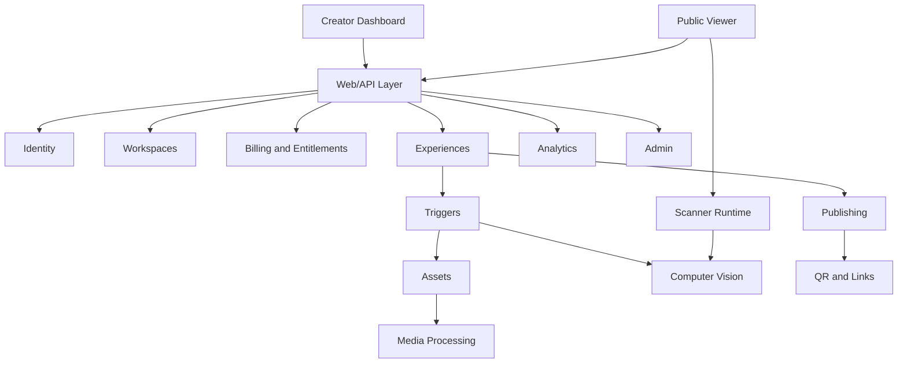
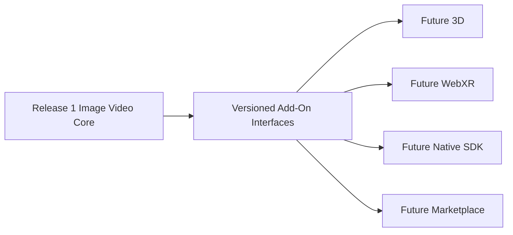

# API And Module Boundaries

Release 1 can remain a modular Flask app. It does not need microservices. It does need clear service interfaces.

## Future Add-On Isolation

The scanner, recognition, publishing, entitlement, and analytics contracts must be versioned so future add-ons do not rewrite the core.

