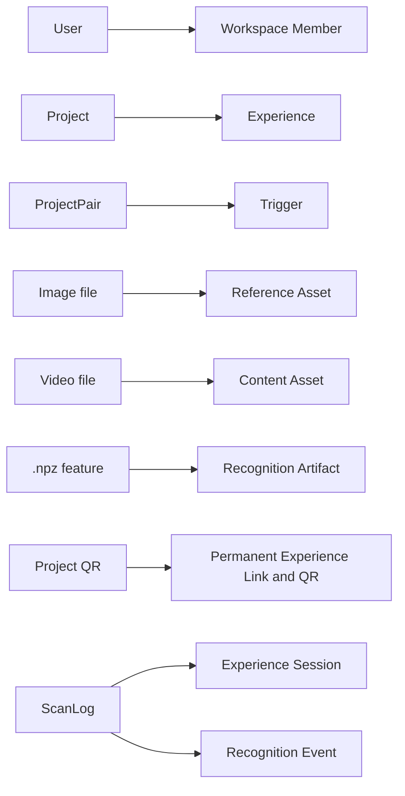

# Migration From Current Model

## Migration Rules

- Existing URLs and QR codes continue working.
- Existing projects are not recreated unnecessarily.
- Published behavior remains compatible.
- New versioned models can wrap current records first.
- Data movement should be reversible until final cutover.
- Migration includes validation reports and rollback plan.

## Revision 1 Additive Migration Phases

Decision status: Approved Release 1 rule.

1. Add new tables and nullable compatibility fields.
2. Backfill default personal Workspaces.
3. Map Projects to Experiences.
4. Map ProjectPairs to Triggers.
5. Preserve legacy IDs and routes.
6. Introduce dual-read compatibility.
7. Validate migrated data.
8. Enable new writes selectively.
9. Monitor.
10. Retire legacy behavior only after approval.

## Safety Requirements

- Every migration run has migration ID, idempotency key, checkpoints, row counts, error report, and dry-run mode.
- Backup verification and database-copy testing are required before touching production data.
- Rollback plan must restore previous application behavior without destructive schema changes.
- Temporary dual-write is allowed only where necessary and must be monitored.
- No destructive rename in the first migration.
- Existing `.npz` recognition artifacts remain usable until regenerated safely and verified.
