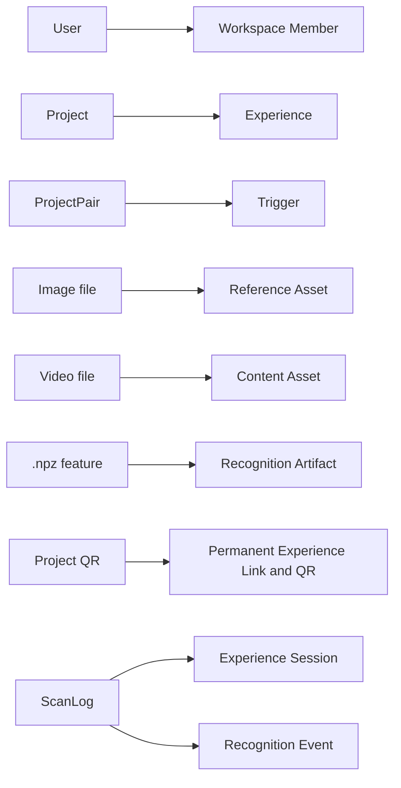

# Migration From Current Model

## Migration Rules

- Existing URLs and QR codes continue working.
- Existing projects are not recreated unnecessarily.
- Published behavior remains compatible.
- New versioned models can wrap current records first.
- Data movement should be reversible until final cutover.
- Migration includes validation reports and rollback plan.

